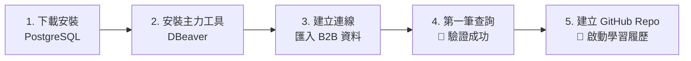

# 01 PostgreSQL 安裝與環境建立指南（保姆級無痛上手版）

> **給轉職初學者的暖心提醒**：
> 安裝資料庫就像是在你的電腦裡打造一個「數位倉庫」，而管理軟體（DBeaver）就像是倉庫的「管理控制台」。只要跟著本篇一步一步操作，避開常見的 2 大坑洞，15 分鐘內就能搞定全部環境並查出你的第一筆資料！

---

## 🗺️ 流程一覽：5 步完成環境與學習歷程建置



---

## 一、安裝 PostgreSQL 資料庫引擎（倉庫本體）

### 推薦路徑：Windows 官方安裝包

1. 前往官網下載：[PostgreSQL Windows Downloads](https://www.postgresql.org/download/windows/)
2. 點擊 **「Download the installer」**，選擇頁面上顯示的最新穩定版（截至 2026 年 9 月為 **PostgreSQL 18.x**）。
3. 雙擊執行下載好的安裝檔，一路點擊 `Next`，**注意以下關鍵設定**：
   - **Components（元件選擇）**：維持全部勾選（預設已包含 PostgreSQL Server、pgAdmin 4、Command Line Tools）。
   - **Data Directory（資料存放目錄）**：維持預設即可。
   - **Password（超級使用者密碼）**：設定 `postgres` 超級使用者的密碼。
     > [!IMPORTANT]
     > 請務必記下這個密碼！建議在學習階段設定為好記的 `postgres123`。
     >
   - **Port（連線埠號）**：維持預設 `5432` 即可。
   - **Advanced Options (Locale)**：維持 `[Default locale]` 或選擇 `Chinese (Traditional)`。
4. 點擊 `Next` 開始安裝，等待進度條跑完。

---

> [!WARNING]
>
> ### 🚦【極度重要避坑紅綠燈 1：略過 Stack Builder】
>
> 安裝完成的最後一個畫面，會出現一個勾選框：**「Launch Stack Builder at exit?」**。
>
> ❌ **請把這個勾選取消，直接點擊「Finish」結束！**
> （如果不小心按到進入了 Stack Builder 視窗，請直接點右下角 **「Cancel（取消）」** 退出即可）。
>
> **為什麼？**
> Stack Builder 只是額外的進階外掛程式庫（如空間地理擴充、進階伺服器叢集等）。在 SQL 學習與轉職實務中完全用不到，勾了只會徒增困擾，初學請一律略過！

---

*(備用進階路徑：若你的電腦已有 Docker，也可以直接在終端機輸入：`docker run --name postgres-dev -e POSTGRES_PASSWORD=postgres123 -p 5432:5432 -d postgres:18`)*

---

## 二、安裝主力操作介面：DBeaver Community（管理控制台）

雖然 PostgreSQL 自帶了 pgAdmin 4，但業界與本 12 個月培訓計畫**唯一強烈推薦使用 DBeaver Community**。

**為什麼首選 DBeaver？**

- 跨平台、完全免費且開源。
- 支援 PostgreSQL、MySQL、Oracle、MSSQL 等所有資料庫，未來上班不論公司用哪種資料庫都能無縫接軌。
- 介面乾淨直觀，自動補全功能強大。

### 下載與安裝

1. 前往官網下載：[DBeaver Community Edition Download](https://dbeaver.io/download/)
2. 下載 **Windows Installer** 並依照提示完成安裝。

---

## 三、在 DBeaver 中建立資料庫連線

1. 開啟 **DBeaver**。
2. 點擊左上角插頭圖示的 **「新增連線 (New Connection)」**，或按快捷鍵 `Ctrl + Shift + N`。
3. 在彈出視窗中選擇 **「PostgreSQL」** ➜ 點擊「下一步」。
4. 填寫連線設定（通常只需輸入密碼）：
   - **Host**: `localhost`（代表本機）
   - **Port**: `5432`
   - **Database**: `postgres`
   - **Username**: `postgres`
   - **Password**: 輸入剛才安裝時設定的密碼（例如 `postgres123`）
   - 勾選 **「記住密碼 (Save password)」**
5. 點擊左下角的 **「測試連線 (Test Connection)」**：
   - *初次連線若跳出「需要下載驅動檔案 (Driver Files)」，直接點擊「下載 (Download)」即可，DBeaver 會全自動下載完成。*
   - 看到跳出「連線成功 (Connected)」的打勾提示後，點擊「確定」。
6. 點擊右下角 **「完成 (Finish)」**。

---

## 四、匯入本模組 B2B 實戰資料集

> [!CAUTION]
>
> ### 🚦【極度重要避坑紅綠燈 2：杜絕「No active connection」報錯】
>
> 許多初學者會點擊最上方的通用按鈕開啟 SQL 編輯器，這會導致編輯器**沒有綁定資料庫**，執行時跳出 `No active connection` 錯誤。
> 請務必依照下列步驟開啟「已綁定連線的編輯器」！

### 步驟 1：開啟已綁定連線的 SQL 編輯器

在 DBeaver 視窗左側的 **「資料庫導覽 (Database Navigator)」** 列表中：

1. 找到剛才建立的 **`postgres`** 連線圖示。
2. 在該連線上按 **滑鼠右鍵** ➜ 選擇 **「SQL 編輯器 (SQL Editor)」➜「新增 SQL 腳本 (New SQL Script)」**（快捷鍵 `Ctrl + ]`）。
3. 此時中央會開啟一個空白編輯器分頁，注意上方狀態列已自動顯示 `postgres - postgres`，代表已正確綁定！

---

### 步驟 2：貼上資料庫建立腳本

1. 在 VS Code 中開啟專案內的腳本檔案：[`data/b2b_m1_sample.sql`](./data/b2b_m1_sample.sql)。
2. 按鍵盤 **`Ctrl + A`**（全選）➜ **`Ctrl + C`**（複製）。
3. 切換回 DBeaver 的 SQL 編輯器，按鍵盤 **`Ctrl + V`**（貼上整份腳本程式碼）。

---

### 步驟 3：整份腳本一鍵執行（注意快捷鍵！）

在 DBeaver 中，執行 SQL 有兩種截然不同的模式：

| 執行模式                                |        快捷鍵        |                     圖示位置                     | 適用時機                             |
| :-------------------------------------- | :-------------------: | :-----------------------------------------------: | :----------------------------------- |
| **執行單一行 / 單一語句**         |   `Ctrl + Enter`   |                   單箭頭`▶`                   | 之後日常練習寫查詢語句時使用         |
| **執行整份腳本 (Execute Script)** | **`Alt + X`** | **雙箭頭 `▶▶`**（編輯器左側直列工具列） | **現在匯入資料庫時必須使用！** |

👉 **請在此時直接按下鍵盤：`Alt + X`**（或點擊左側工具列的 **雙箭頭 ▶▶**）。
稍等 1~2 秒，下方會顯示執行進度，完成後會出現執行成功的摘要訊息。

---

## 五、🎉 見證成果與第一筆查詢驗證（Quick Win！）

現在，讓我們親眼確認資料表是否已經全部建立好，並跑出你的第一行 SQL！

### 1. 檢查 5 張資料表

1. 回到 DBeaver 左側的「資料庫導覽」面板。
2. 依序展開樹狀目錄：`postgres` ➜ **`資料庫 (Databases)`** ➜ `postgres` ➜ **`綱要群 (Schemas)`** ➜ `public` ➜ **`表 (Tables)`**。
3. 對著 `表 (Tables)` 按滑鼠右鍵 ➜ 點擊 **「重新整理 (Refresh)」**（或選取後按鍵盤 `F5`）。
4. 你會看到 5 張專門為 B2B 商業實戰設計的資料表整齊出現：
   - 🏢 **`customers`**（企業客戶名冊）
   - 🧑‍💼 **`salespeople`**（業務團隊名單）
   - 📦 **`products`**（硬體與軟體產品型錄）
   - 🧾 **`orders`**（客戶採購訂單主表）
   - 📝 **`order_items`**（訂單內各品項明細與金額）

---

### 2. 敲下你的第一行 SQL

1. 在剛才的 SQL 編輯器中清空內容，或另起一行輸入以下程式碼：

   ```sql
   SELECT customer_id, company_name, city, credit_limit, status FROM customers LIMIT 5;
   ```

2. 將滑鼠游標停在這行程式碼上，按鍵盤 **`Ctrl + Enter`**（執行單行查詢）。
3. 觀察編輯器下方彈出的結果表格，你將看見前 5 家真實企業客戶資料：

| customer_id | company_name      | city       | credit_limit | status |
| :---------: | :---------------- | :--------- | :----------: | :----: |
|      1      | Apex Semi Tech    | Hsinchu    |  1000000.00  | ACTIVE |
|      2      | BlueSky Cloud Ltd | Taipei     |  500000.00  | ACTIVE |
|      3      | CyberCore Inc     | New Taipei |  300000.00  | ACTIVE |
|      4      | Delta Logistics   | Taichung   |  400000.00  | ACTIVE |
|      5      | Echo Energy Corp  | Kaohsiung  |  800000.00  | ACTIVE |

> **🎉 太棒了！看到這張表就代表環境 100% 建立成功！**
> 你已經成功跨越了轉職的第一道高牆！你的電腦現在擁有完整的企業級資料庫環境，隨時準備進行實戰分析。

---

## 六、建立你的轉職作品集：Git 與 GitHub Repo 實戰設定（保姆級教學）

> [!TIP]
> **為什麼計畫中每一天都有「Git Commit 建議」？**
> 1. **不可抹滅的成長證明**：面試時說「我學過 SQL」不夠有說服力；但在 GitHub 上有連續 30 天由淺入深的 Commit 紀錄與綠色活動格子（Contribution Graph），面試官一眼就能看出你的自律與代碼實力。
> 2. **安全的代碼時光機**：寫錯或改爛了隨時能退回前一天的版本，練習筆記與作業永遠不會遺失。

### 1. 核心觀念：Git 與 GitHub 有什麼不同？
* **Git（本機工具）**：裝在電腦裡的「版本存檔器 / 時光機」，負責在本機記錄每次程式碼的修改。
* **GitHub（雲端平台）**：微軟旗下的程式碼社群與展示平台，負責存放你同步上傳的專案，讓全世界與面試官都能閱覽。

---

### 步驟 1：註冊 GitHub 帳號（若已有可跳過）
1. 前往 [github.com](https://github.com) 點擊右上角 **Sign up**。
2. 依照網頁提示填寫 Email、密碼與使用者名稱（Username，建議取專業、簡潔的英文名稱）。
3. 收取信箱驗證碼並完成驗證。

---

### 步驟 2：在 VS Code 內建一鍵發布到 GitHub（免打任何終端機指令！）

VS Code 已經原生整合 GitHub，新手完全不需要在終端機敲打複雜的指令：

1. **確認 VS Code 開啟目錄**：
   確保目前 VS Code 開啟的根目錄是包含 `轉職計畫` 或 `01_Month01_SQL基礎` 的專案資料夾。
2. **切換到「原始檔控制」面板**：
   點擊 VS Code 最左側直列工具列上的 **「原始檔控制」圖示**（長得像三個圓點被線連起來的圖示），或直接按快捷鍵 **`Ctrl + Shift + G`**。
3. **點擊「發行至 GitHub (Publish to GitHub)」**：
   * 如果看到按鈕寫著 **「發行至 GitHub」** 或 **「初始化存放庫 (Initialize Repository)」**，直接點擊。
   * VS Code 會在視窗右下角提示要求存取 GitHub，點擊 **「Allow（允許）」**，瀏覽器會自動彈出 GitHub 授權網頁，點擊確認授權。
4. **選擇公開儲存庫（Public）**：
   * 頂部搜尋列會跳出兩種選項：
     - `Publish to GitHub public repository`（**強烈推薦選 Public**，面試官才看得到你的作品）
     - `Publish to GitHub private repository`
5. **確認儲存庫名稱**：
   * 預設名稱建議填入 **`B2B-SQL`**，按下 `Enter`。
   * VS Code 就會全自動建立遠端儲存庫，並把現有教材與設定全部推送到你的 GitHub！

---

### 步驟 3：日常學習「如何完成一次 Git Commit 存檔與同步」

學習計畫表格中每天的「Git Commit 建議」（例如 Day 1 的 `feat: 初始化 PostgreSQL 與 DBeaver 環境`），操作步驟只需三秒鐘：


1. **完成當日練習**：例如你寫好了練習題的 SQL 檔案或筆記並按 `Ctrl + S` 存檔。
2. **打開原始檔控制**：按 **`Ctrl + Shift + G`**，你會看到「變更 (Changes)」下方列出你今天動過的檔案。
3. **輸入 Commit 訊息**：在最上方的輸入框（顯示 *訊息* 或 *Message*），貼上當天計畫建議的說明，例如：
   ```text
   feat: 初始化 PostgreSQL 與 DBeaver 環境
   ```
4. **點擊認可 (Commit)**：點擊輸入框下方的藍色按鈕 **「認可 (Commit)」**（這代表在本機建立存檔點）。
5. **點擊同步 (Sync Changes / Push)**：點擊藍色按鈕 **「同步變更 (Sync Changes)」**（或左下角狀態列的循環旋轉箭頭）。
6. **線上確認**：打開你的 GitHub 網頁（`https://github.com/你的帳號/B2B-SQL`），你會看見你的程式碼與當日 Commit 訊息已成功登上雲端！

---

## 🔗 下一步與章節導航

- **下一篇（學習規劃）**：[02_本月學習計畫與目標.md](./02_本月學習計畫與目標.md)（4 週線性學習日程表）
- **新手資料庫探索**：[03_讀懂陌生資料庫的五步驟.md](./03_讀懂陌生資料庫的五步驟.md)（Schema Thinking 與 DBeaver 探索起手式）
- **語法講義**：[04_SQL核心語法_SELECT到JOIN全解析.md](./04_SQL核心語法_SELECT到JOIN全解析.md)（5 大階梯式實戰關卡與底層執行順序）
- **資料庫腳本**：[data/b2b_m1_sample.sql](./data/b2b_m1_sample.sql)（Canonical 資料表定義與初始化腳本）
- **回到目錄**：[Month 01 學習模組主導航](./README.md)
