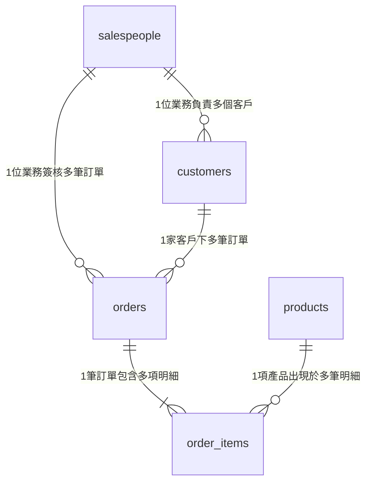

# 03 — 讀懂陌生資料庫的五步驟（新手探索起手式）

> **「給你一個剛匯入的陌生資料庫，你的第一步要做什麼？」**
> 資料工程師與數據分析師的答案絕不是胡亂下 `SELECT *`，而是先建立該資料庫的 **Schema 心智模型**。
> 本篇是你剛跑完 `01` 環境建置後的第 1 個探索指南，帶你用 DBeaver 的視覺化介面與最直觀的方法看懂資料！

---

## 為什麼要學「讀資料庫」？

現代企業有 AI 工具可以幫忙寫 SQL，但 AI 往往不知道：

- `customer_id` 在這套 ERP 系統裡是不是真正唯一的 Key
- 一筆訂單到底是一列、還是每買一項商品就拆成一列
- 這家企業的「已取消訂單」是不是仍然保留在資料表裡

**這些判斷仰賴你對資料結構（Schema）與資料粒度（Data Grain）的理解，這是資料人的核心硬實力。**

---

## 五步驟讀懂陌生資料庫 SOP

```text
剛連線資料庫
    │
    ├─ Step 1：有哪些 Table？（了解業務追蹤主題）
    │
    ├─ Step 2：各表的 Primary Key (PK) 是什麼？（每一列代表誰？）
    │
    ├─ Step 3：Foreign Key (FK) 怎麼關聯？（表與表怎麼串？）
    │
    ├─ Step 4：畫出資料庫關係圖（建立業務流程全景）
    │
    └─ Step 5：確認 Data Grain 資料粒度（一列業務實體的細緻度）
```

---

### Step 1 — 列出並確認所有 Table

剛連上 PostgreSQL，第一步是確認資料庫到底包含哪幾張表。

#### 方式 A：使用 DBeaver 左側視覺化導覽（最推薦新手）

在 DBeaver 左側的 **連接 / Database Navigator** 依序展開樹狀目錄：

> 💡 **DBeaver 繁體中文 ⬌ 英文介面對照路徑**：
>
> 1. `postgres`（連線名稱）
> 2. ➜ **`資料庫`**（`Databases`）
> 3. ➜ **`postgres`**
> 4. ➜ **點開「綱要群」**（⚠️ 繁體中文版將 **`Schemas`** 翻譯為 **`綱要群`**）
> 5. ➜ 點開 **`public`**
> 6. ➜ 點開 **`表`**（英文版為 **`Tables`**）

#### 方式 B：用通用 SQL 查詢表清單

打開 DBeaver SQL 編輯器（快捷鍵 `F3`），執行：

```sql
SELECT table_name 
FROM information_schema.tables 
WHERE table_schema = 'public' 
ORDER BY table_name;
```

> **思考提問**：這 5 張表勾勒出什麼主題？
> 答案：這是一套典型的 **B2B 科技產品代理商** 營運資料庫（包含業務拓展、客戶往來、訂單交易、商品庫存）。

---

### Step 2 — 找出每張表的 Primary Key（主鍵）

**Primary Key (PK)** 是資料表的唯一識別碼，確保「這一列資料在全表具有唯一性」。

#### 在 DBeaver 怎麼看 PK？

- 雙擊左側的任何一張表（例如 `customers`）。
- 切換到 **Properties（屬性）** ➜ 點選 **Columns（欄位）** 或 **Unique Keys**。
- 會看到欄位旁有一個 🔑 小鑰匙圖示，這就是 Primary Key！

```text
salespeople  ➜ salesperson_id  （每一列代表一位業務員）
customers    ➜ customer_id      （每一列代表一家客戶）
products     ➜ product_id       （每一列代表一項產品）
orders       ➜ order_id         （每一列代表一筆訂單）
order_items  ➜ item_id          （每一列代表訂單中的一項商品明細）
```

---

### Step 3 — 找出 Foreign Key（外鍵關聯）

**Foreign Key (FK)** 是用來「串連其他表」的欄位，它就像一根指針，指向另一張表的 Primary Key。

#### 在 DBeaver 怎麼看 FK？

1. 在表的 **Properties** 介面中，點選左側垂直標籤欄的 **「外鍵」**。
2. 仔細看右側表格的欄位抬頭（**從左至右完全與 DBeaver 欄位順序一致**）：
   - **`名稱`**：外鍵約束名稱（例如 `customers_salesperson_id_fkey`）。
   - **`欄位約束屬性`**：本表用來連線的外鍵欄位（例如 `salesperson_id`）。
   - **`擁有者`**：這條外鍵所屬的資料表（例如 `customers`）。
   - **`外鍵欄位的參考欄位`**：連到目標表的哪一個主鍵（例如 `salespeople_pkey` ➜ `salesperson_id`）。
   - **`外鍵關聯實體`**：連到的目標資料表名稱（例如 `salespeople`）。

---

#### 5 張表外鍵對照表

| DBeaver 欄位：`名稱`（外鍵約束代號） | DBeaver 欄位：`欄位約束屬性`（★ 本表外鍵欄位） | DBeaver 欄位：`擁有者`（你目前點開的表） | DBeaver 欄位：`外鍵欄位的參考欄位`（目標表的主鍵） | DBeaver 欄位：`外鍵關聯實體`（★ 指向的目標父表） | 商業白話意涵 |
| :------------------------------------- | :------------------------------------------------ | :----------------------------------------- | :--------------------------------------------------- | :-------------------------------------------------- | :----------------------- |
| `customers_salesperson_id_fkey` | **`salesperson_id`** | `customers` | `salespeople_pkey` (`salesperson_id`) | **`salespeople`** | 客戶隸屬於哪位負責業務 |
| `orders_customer_id_fkey` | **`customer_id`** | `orders` | `customers_pkey` (`customer_id`) | **`customers`** | 這筆訂單是由哪家客戶下的 |
| `orders_salesperson_id_fkey` | **`salesperson_id`** | `orders` | `salespeople_pkey` (`salesperson_id`) | **`salespeople`** | 這筆訂單是由哪位業務經手 |
| `order_items_order_id_fkey` | **`order_id`** | `order_items` | `orders_pkey` (`order_id`) | **`orders`** | 該商品明細屬於哪一筆訂單 |
| `order_items_product_id_fkey` | **`product_id`** | `order_items` | `products_pkey` (`product_id`) | **`products`** | 該明細採購的是哪一項產品 |

---

### Step 4 — 畫出關係圖（建立心智模型）

#### DBeaver 內建一鍵生成 ER 圖神功能

1. 展開左側的 **`綱要群`**（Schemas）➜ 找到 **`public`**。
2. 雙擊 `public`，在右側視窗點選 **「實體關係圖」** 分頁，或在 `public` 上按右鍵選「視界圖」，快捷鍵(Ctrl + Shift + Enter)。
3. DBeaver 會自動為你繪製出一張完整的實體關聯圖（ER Diagram）！



這張圖是你在 Month 01 寫任何 SQL 時的「北極星地圖」！

---

### Step 5 — 最核心的問題：Data Grain（資料粒度）

> **「這張表的一列（Row），到底代表什麼具體事物？」**

這個概念叫做 **Data Grain（資料粒度）**。這是初學者從「能寫 SQL」跨越到「不會算錯數字」的最關鍵分水嶺！

| 資料表名稱 | Data Grain（一列資料代表的業務實體） |
| :-------------- | :----------------------------------------------------------------- |
| `salespeople` | 一位業務同仁 |
| `customers` | 一家企業客戶 |
| `products` | 一個產品 SKU |
| `orders` | 一筆商業交易訂單（記錄整筆總金額） |
| `order_items` | 一筆訂單中**被購買的一項商品明細**（記錄單項購買數量與單價） |

> [!WARNING]
> **為什麼現在就要記住 Grain？**
> 一筆 `orders` 底下可能有 5 個 `order_items`。如果之後你跨表關聯時沒有注意粒度，把 `orders` 跟 `order_items` 串在一起計算訂單總額，訂單金額就會被重複加總 5 次（這就是惡名昭彰的 **Fan-out 膨脹**）！
> *不用擔心，我們在後續的 [06_JOIN陷阱與資料粒度問題](./06_JOIN陷阱與資料粒度問題.md) 會帶你手把手避開這個大坑！*

---

## 實戰：用最簡單的查詢探索 M1 資料集

打開 DBeaver SQL 編輯器，動手執行這幾道起手式指令：

```sql
-- 探索 1：快速清點 5 張表各自目前有多少筆資料
SELECT 'salespeople' AS table_name, COUNT(*) AS total_rows FROM salespeople
UNION ALL
SELECT 'customers', COUNT(*) FROM customers
UNION ALL
SELECT 'products', COUNT(*) FROM products
UNION ALL
SELECT 'orders', COUNT(*) FROM orders
UNION ALL
SELECT 'order_items', COUNT(*) FROM order_items;
```

```sql
-- 探索 2：肉眼檢視客戶表的前 5 筆，確認有哪些欄位
SELECT * FROM customers LIMIT 5;
```

```sql
-- 探索 3：檢視訂單表的前 5 筆，觀察 customer_id 與 total_amount
SELECT * FROM orders LIMIT 5;
```

---

## 🎯 新手探索自我檢核

讀完本篇並在 DBeaver 操作後，請確認自己能否回答：

- [ ] 我能在 DBeaver 左側找到 5 張 Table 並看到欄位清單。
- [ ] 我知道每張表的 Primary Key (PK) 分別是什麼欄位。
- [ ] 我能看懂 `order_items` 的 Grain（明細）跟 `orders` 的 Grain（訂單）有什麼本質區別。
- [ ] 我成功在 DBeaver 執行了起手式探索 SQL，查出了各表的總筆數。

---

## 🔗 章節導航

- **上一篇**：[02_本月學習計畫與目標.md](./02_本月學習計畫與目標.md)
- **下一篇**：[04_SQL核心語法_SELECT到JOIN全解析.md](./04_SQL核心語法_SELECT到JOIN全解析.md)（正式進入語法闖關！）
- **回到目錄**：[Month 01 學習模組主導航](./README.md)
