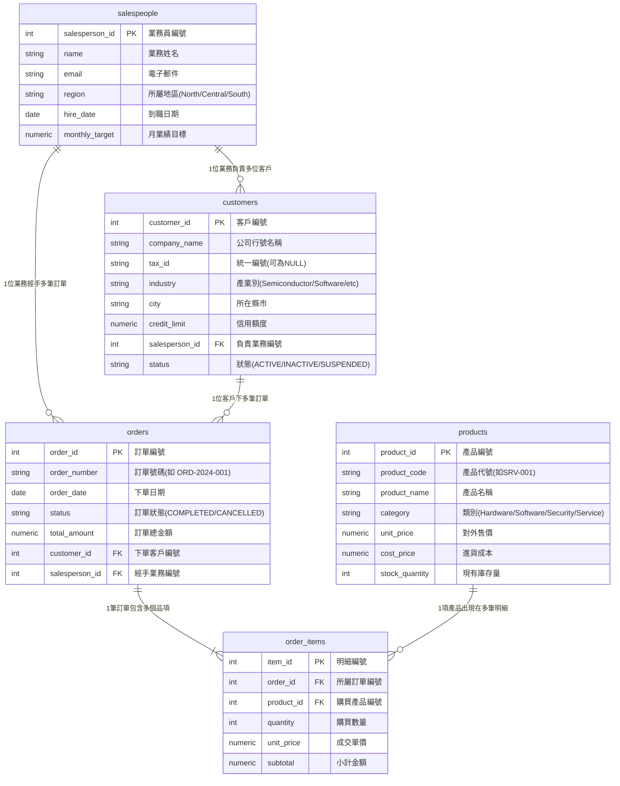

# 04 SQL 核心語法精粹：從 SELECT 到 JOIN（階梯式實戰講義）

> **為什麼你不需要死背語法？**
> SQL 不是一門「程式語言」，而是你與資料庫溝通的「商業英語」。每一句 SQL，本質上都是在回答一個具體的商業問題（例如：「上個月哪些客戶沒有下單？」、「誰是今年的業績冠軍？」）。
> 請打開 **DBeaver**，一邊閱讀本篇，一邊在剛建好的資料庫中輸入範例程式碼，對照下方的【預期查詢結果】，親身體驗數據被你調度出來的成就感！

---

## 🗺️ 第一步：建立商業資料庫的心智模型（Mental Model）

在寫語法之前，我們先快速複習在 [03_讀懂陌生資料庫的五步驟](./03_讀懂陌生資料庫的五步驟.md) 中認識的 **B2B 科技代理商資料庫** 5 張表關係圖：



---

## 🧗 5 大階梯式實戰關卡

---

### 關卡 1：最單純的問與答 —— SELECT 欄位與 WHERE 條件過濾

> 🎯 **這一節最重要的一件事（心智定位）**：
> SELECT 與 WHERE 是資料庫檢索的「投影（選欄）」與「過濾（挑列）」，決定了你調取數據的視野與邊界。
>
> 💼 **為什麼非學不可（避坑痛點）**：
> 不懂精確過濾，就只能把幾十萬筆原始資料全倒出來手動找，不僅拖垮伺服器記憶體，更極易把客戶統編、薪資等敏感資料意外洩漏。

這是 SQL 最基礎的本質：**「我想看什麼（SELECT）？從哪張表看（FROM）？只要符合什麼條件的列（WHERE）？」**

#### 商業需求情境

> 業務主管說：「請幫我調出所有
> 位於 **台北 (Taipei)**，而且信用額度高於或等於 **10 萬** 的客戶名單。」

#### SQL 程式碼（請在 DBeaver 執行）

```sql
SELECT 
    customer_id,
    company_name,
    city,
    credit_limit AS limit_amount  -- 使用 AS 為欄位取好讀的別名
FROM customers
WHERE city = 'Taipei' 
  AND credit_limit >= 100000;
```

#### 📊 預期查詢結果預覽

執行後，DBeaver 下方將精確回傳 4 筆資料：

| customer_id | company_name       | city   | limit_amount |
| :---------: | :----------------- | :----- | :----------: |
|      2      | BlueSky Cloud Ltd  | Taipei |  500000.00  |
|      6      | Future AI Labs     | Taipei |  600000.00  |
|      8      | Horizon BioTech    | Taipei |  450000.00  |
|     10     | Jovial Media Group | Taipei |  100000.00  |

#### 常用比較運算子速查

- **等值與大小**：`=`, `!=` (或 `<>`), `>`, `<`, `>=`, `<=`
- **區間篩選**：`credit_limit BETWEEN 100000 AND 500000`（包含邊界值）
- **多值匹配**：`city IN ('Taipei', 'Hsinchu', 'Taichung')`（只要在清單內皆符合）
- **邏輯組合**：`AND`（皆滿足）、`OR`（滿足其一）、`NOT`（反向排除）

> [!TIP]
> 💡 **避坑小提示**：在 SQL 中，文字字串請一律用 **單引號**（如 `'Taipei'`）。雙引號在 PostgreSQL 中通常用來表示資料庫物件名稱（如欄位名、表名）。

> [!WARNING]
> ⚠️ **養成好習慣：不要寫 `SELECT *`！**初學者很容易圖省事寫 `SELECT * FROM customers`，一次撈出所有欄位。但在業界這是明確的壞習慣：
>
> - 浪費網路傳輸與記憶體（正式環境的表可能有上百個欄位）
> - 可能意外暴露薪資、身分證號等敏感欄位
> - 當表結構變更時，依賴 `*` 的程式容易出錯
>
> ✅ 請從第一天就養成「**明確列出需要的欄位**」的職業習慣！

#### ✋ 關卡 1 空白頁挑戰（不看上方範例）

> **業務助理提問**：
> 「請幫我找出所有產業類別（`industry`）為 `'Semiconductor'` 且所在城市**不是** `'Taipei'` 的客戶，只需顯示客戶編號（`customer_id`）、公司名稱（`company_name`）與所在城市（`city`）。」
>
> ⚠️ **請在 DBeaver 空白編輯器中手寫出你的答案，不要偷看下方！**

<details>
<summary>💡 需要思考提示嗎？（點擊展開解題思路）</summary>

1. 資料來源表：`customers`
2. 投影欄位：`customer_id`, `company_name`, `city`
3. 過濾條件：`industry = 'Semiconductor'` 搭配 `city != 'Taipei'`（或 `<>`）
</details>

<details>
<summary>✅ 寫完了？點擊對照標準解答</summary>

```sql
SELECT 
    customer_id,
    company_name,
    city
FROM customers
WHERE industry = 'Semiconductor' 
  AND city != 'Taipei';
```
</details>

> 💡 **關卡 1 核心收斂**：
> **投影選欄、過濾挑列；字串單引號，堅決不寫 SELECT *。**

---

### 關卡 2：資料排版、去重與模糊搜尋 —— ORDER BY, LIMIT, DISTINCT, LIKE

> 🎯 **這一節最重要的一件事（心智定位）**：
> ORDER BY, LIMIT, DISTINCT 是資料的「排版儀容師」，將雜亂無章的流水帳梳理成高層決策榜單與乾淨的統計母體。
>
> 💼 **為什麼非學不可（避坑痛點）**：
> 主管要看 Top 3 高單價產品，若你丟出 100 筆亂序清單就是不及格的商業溝通；忘記用 `DISTINCT` 去重更會讓客戶數統計虛胖翻倍。

在實際商業分析中，主管通常不會想看未經整理的原始流水帳。本關卡掌握三個最高頻的資料處理技巧：排序截取（排行榜）、關鍵字匹配與重複資料清理。

#### 4 大核心排版與過濾語法速查

- **`ORDER BY 欄位 DESC / ASC`**：指定欄位排序（`DESC` 降冪/由大到小，`ASC` 升冪/由小到大，預設為升冪）
- **`LIMIT N`**：只截取前 N 筆資料（常見於排行榜）
- **`ILIKE '%關鍵字%'`**：不分大小寫模糊搜尋（`%` 代表任意長度的文字字串）
- **`DISTINCT 欄位`**：過濾重複資料列，只保留唯一值

---

#### 1. 範例一（ORDER BY + LIMIT）：高單價產品排行榜

##### 商業需求情境

> 採購主管說：「請找出定價在 **5 萬元以上** 的高階產品，依照售價從最高排到最低，只列出**最貴的前 3 名**。」

##### SQL 程式碼（請在 DBeaver 執行）

```sql
SELECT 
    product_name,
    category,
    unit_price
FROM products
WHERE unit_price >= 50000
ORDER BY unit_price DESC            -- DESC 為由大到小(降冪)，ASC 為由小到大(升冪，預設)
LIMIT 3;                            -- 只抓取排名前 3 筆
```

##### 📊 預期查詢結果預覽

| product_name                | category | unit_price |
| :-------------------------- | :------- | :--------: |
| Enterprise Server Pro       | Hardware | 120000.00 |
| Data Analytics Suite (1-Yr) | Software |  95000.00  |
| Cloud CRM Enterprise (1-Yr) | Software |  60000.00  |

---

#### 2. 範例二（ILIKE）：關鍵字模糊搜尋

##### 商業需求情境

> 行銷主管說：「我想針對軟體與雲端方案做促銷，但我記不得完整的品名，請幫我撈出名稱中含有 **'Cloud'** 或 **'Suite'** 的所有產品。」

##### SQL 程式碼（請在 DBeaver 執行）

```sql
SELECT 
    product_code,
    product_name,
    category,
    unit_price
FROM products
WHERE product_name ILIKE '%Cloud%' 
   OR product_name ILIKE '%Suite%';
```

##### 📊 預期查詢結果預覽

| product_code | product_name                | category | unit_price |
| :----------: | :-------------------------- | :------- | :--------: |
|   SFT-001   | Cloud CRM Enterprise (1-Yr) | Software |  60000.00  |
|   SFT-002   | Data Analytics Suite (1-Yr) | Software |  95000.00  |

---

#### 3. 範例三（DISTINCT）：名冊去重與名單整理

##### 商業需求情境

> 通路策略主管說：「我們目前全台客戶分佈在哪些城市？請給我一份城市清單（不要給我重複出現的城市名稱）。」

##### SQL 程式碼（請在 DBeaver 執行）

```sql
-- 💡 對照提醒：如果不加 DISTINCT，會直接吐出 10 筆資料（光是 Taipei 就重複出現 4 次）
-- 加上 DISTINCT 後，系統會自動剔除重複值：
SELECT DISTINCT city 
FROM customers 
WHERE city IS NOT NULL
ORDER BY city ASC;                  -- 依字母排序，更利於主管閱讀
```

##### 📊 預期查詢結果預覽

原本 10 筆包含重複的清單，瞬間收斂成乾淨俐落的 6 個重點城市：

| city       |
| :--------- |
| Hsinchu    |
| Kaohsiung  |
| New Taipei |
| Taichung   |
| Tainan     |
| Taipei     |

---

> [!CAUTION]
> 🚨 **世紀大坑：NULL 值的比較**
> 在資料庫中，`NULL` 代表「未知/未填寫」，**它不等於 0，也不等於空字串**！
> ❌ 錯誤寫法：`WHERE tax_id = NULL` 或 `WHERE tax_id != NULL`（這永遠查不到任何資料！）
> ✅ 正確寫法：`WHERE tax_id IS NULL` 或 `WHERE tax_id IS NOT NULL`。

> [!TIP]
> 💡 **進階避坑：`BETWEEN` 與日期型別的邊界陷阱**
> 在本資料庫中 `order_date` 的型別是 `DATE`（純日期），所以 `BETWEEN '2024-01-01' AND '2024-03-31'` 可以正確抓到 3/31 的資料。
> 但如果欄位型別是 `TIMESTAMP`（包含時分秒），`BETWEEN` 的結束邊界 `'2024-03-31'` 會被解讀為 `2024-03-31 00:00:00`，**導致 3/31 當天 00:00:01 以後的資料全部遺漏！**
> ✅ 業界最佳實踐是改用「半開區間」寫法：
>
> ```sql
> WHERE order_date >= '2024-01-01' AND order_date < '2024-04-01'
> ```
>
> 這樣無論欄位是 DATE 或 TIMESTAMP 都安全！

#### ✋ 關卡 2 空白頁挑戰（不看上方範例）

> **風控主管提問**：
> 「請找出所有未填寫統一編號（`tax_id IS NULL`）的客戶名單，依照其信用額度（`credit_limit`）由大到小排序，只取額度最高的前 2 名客戶，顯示其 `company_name` 與 `credit_limit`。」
>
> ⚠️ **請在 DBeaver 空白編輯器中手寫完成，再展開對照！**

<details>
<summary>💡 需要思考提示嗎？（點擊展開解題思路）</summary>

1. 資料來源表：`customers`
2. 過濾條件：`tax_id IS NULL`（切記不能寫 `= NULL`）
3. 排序：`ORDER BY credit_limit DESC`
4. 截取筆數：`LIMIT 2`
</details>

<details>
<summary>✅ 寫完了？點擊對照標準解答</summary>

```sql
SELECT 
    company_name,
    credit_limit
FROM customers
WHERE tax_id IS NULL
ORDER BY credit_limit DESC
LIMIT 2;
```
</details>

> 💡 **關卡 2 核心收斂**：
> **排序看 DESC/ASC，去重用 DISTINCT；NULL 比較必用 IS，半開區間防邊界。**

---

### 關卡 3：資料總結與群組分析 —— 聚合函數、GROUP BY 與 HAVING

> 🎯 **這一節最重要的一件事（心智定位）**：
> GROUP BY 的本質是「資料降維與壓縮」，將千萬筆明細折疊成具有商業維度的統計指標。
>
> 💼 **為什麼非學不可（避坑痛點）**：
> 如果不分組，你就無法回答「哪區客戶最多」、「各類別平均單價」等宏觀指標；若在 WHERE 裡誤寫聚合函數（如 `WHERE COUNT(*) >= 2`），資料庫會直接噴錯中斷！

當主管不再問「單一筆資料」，而是問「總計」、「平均」、「分組表現」時，就是聚合函數登場的時機。

#### 6 大核心計算與聚合函數

- `COUNT(*)`：計算總筆數
- `COUNT(DISTINCT 欄位)`：計算**不重複**的數量（例如 `COUNT(DISTINCT city)` 可統計有幾個不同城市）
- `SUM(欄位)`：數值加總
- `AVG(欄位)`：計算平均值
- `MAX(欄位)` / `MIN(欄位)`：找出極大值與極小值
- `ROUND(數值, 小數位數)`：**四捨五入取小數位**（`AVG` 的必備黃金搭檔！例如 `ROUND(..., 2)` 代表保留 2 位小數，避免小數點後出現落落長的一長串，讓商業報表整齊專業）

> [!NOTE]
> 💡 `DISTINCT` 除了可以寫在 `SELECT DISTINCT city` 去重整列之外，還可以寫在聚合函數**內部**，例如 `COUNT(DISTINCT customer_id)`。兩種用法效果完全不同，在進階題庫（Q26、Q30）中會頻繁使用！

#### 商業需求情境

> 經營管理團隊說：「請幫我按 **所在城市 (city)** 分組，計算每個城市共有多少客戶、平均信用額度是多少，但**只列出客戶數大於等於 2 家** 的重點發展城市。」

#### SQL 程式碼（請在 DBeaver 執行）

```sql
SELECT 
    city,
    COUNT(customer_id) AS total_customers,
    ROUND(AVG(credit_limit), 2) AS avg_credit_limit  -- 搭配 ROUND 四捨五入取小數點後 2 位
FROM customers
WHERE city IS NOT NULL
GROUP BY city
HAVING COUNT(customer_id) >= 2
ORDER BY total_customers DESC;
```

#### 📊 預期查詢結果預覽

| city     | total_customers | avg_credit_limit |
| :------- | :-------------: | :--------------: |
| Taipei   |        4        |    412500.00    |
| Taichung |        2        |    450000.00    |

*(其餘只有 1 家客戶的新竹、新北、高雄、台南皆被 `HAVING` 精準過濾)*

---

> [!IMPORTANT]
>
> ### 💡【頓悟時刻】為什麼要有 HAVING？SQL 的「書寫順序」vs「底層執行順序」
>
> 許多初學者會問：「為什麼過濾分組結果不能直接在 `WHERE` 裡面寫 `WHERE COUNT(*) >= 2`？」
> **答案是：資料庫底層的執行順序，跟我們打字的書寫順序完全不同！**

```text
【我們打字的書寫順序】               【資料庫真正的執行順序】
1. SELECT  (我想看什麼)            1. FROM & JOIN (先找到哪幾張表)
2. DISTINCT(去除重複)              2. WHERE       (先做單筆資料列的初步過濾)
3. FROM    (資料來源表)            3. GROUP BY    (將過濾後的資料進行分組打包)
4. JOIN    (關聯其他表)            4. HAVING      (對分組計算後的數字做二次篩選！)
5. WHERE   (單列過濾條件)          5. SELECT      (選取要顯示的欄位、計算別名)
6. GROUP BY(分組依據)              6. DISTINCT    (去除重複項目)
7. HAVING  (分組後的篩選)          7. ORDER BY    (將最終產出的表格進行排序)
8. ORDER BY(排序結果)              8. LIMIT       (最後只拿前 N 筆交給使用者)
9. LIMIT   (截取前 N 筆)
```

#### 🍳 超好記心智模型：「大廚備料上菜法」

死記字母容易忘，想像你是一位在廚房為主管準備宴席料理的大廚：

- **第一階段：搬食材與洗菜（【找資料】`FROM` ➜ `WHERE`）**

  1. **`FROM & JOIN`（搬食材）**：先去倉庫與冰箱，把需要的食材（資料表）全搬上料理台。💡 *這也是為什麼表別名 `customers c` 一開始就被資料庫記住！*
  2. **`WHERE`（挑掉爛菜葉）**：還沒下鍋前，先把發霉、不合格的單一原料直接丟掉（單筆資料初步過濾）。
- **第二階段：分類切盤與品管（【分組算】`GROUP BY` ➜ `HAVING`）**
  3. **`GROUP BY`（切丁分盤）**：把肉裝一盤、菜裝一盤（按城市、類別分門別類打包）。
  4. **`HAVING`（檢查哪盤太少）**：分盤後進行二次品管，份量太少（例如客戶數 < 2）的整盤撤掉不煮（對聚合統計數字做篩選）。
- **第三階段：擺盤上桌（【端上桌】`SELECT` ➜ `ORDER BY` ➜ `LIMIT`）**
  5. **`SELECT`（擺盤上菜）**：決定端哪幾道菜到客人面前，並在菜單標上好聽的菜名（選取欄位、計算別名）。
  6. **`ORDER BY`（排整齊）**：依價格由貴到便宜依序排好。
  7. **`LIMIT`（主廚推薦）**：最後只端出「最頂級的前 3 道」給客人。

---

👉 **3 個關鍵實戰結論**：

- **`HAVING` 才能過濾聚合函數**：因為 `WHERE`發生在分組之前，根本還沒計算總數；而 `HAVING`發生在分組之後，所以只有 `HAVING` 能過濾 `COUNT` / `SUM`！
- **`WHERE` 不能用欄位別名**：因為 `WHERE`執行時，`SELECT`還沒執行，你在後面取的別名，前面根本還不認識！
- **`ORDER BY` 可以用欄位別名**：因為 `ORDER BY`執行時，`SELECT`已經執行完畢，你在前面取的別名，此時已經可以直接拿來排序！

#### ✋ 關卡 3 空白頁挑戰（不看上方範例）

> **產品主管提問**：
> 「請按產品類別（`category`）分組，計算各類別的產品品項總數，以及該類別的平均售價（`unit_price`，四捨五入取 2 位小數）。我們只想看**平均售價大於或等於 30,000 元**的高價值產品類別，並依照平均售價由高到低排序。」
>
> ⚠️ **請在 DBeaver 空白頁手寫代碼，不要偷看下方！**

<details>
<summary>💡 需要思考提示嗎？（點擊展開解題思路）</summary>

1. 資料來源表：`products`
2. 分組維度：`GROUP BY category`
3. 聚合計算：`COUNT(*) AS total_items`，`ROUND(AVG(unit_price), 2) AS avg_price`
4. 分組後篩選：`HAVING AVG(unit_price) >= 30000`（切記不能在 WHERE 寫 AVG）
5. 排序：`ORDER BY avg_price DESC`
</details>

<details>
<summary>✅ 寫完了？點擊對照標準解答</summary>

```sql
SELECT 
    category,
    COUNT(*) AS total_items,
    ROUND(AVG(unit_price), 2) AS avg_price
FROM products
GROUP BY category
HAVING AVG(unit_price) >= 30000
ORDER BY avg_price DESC;
```
</details>

> 💡 **關卡 3 核心收斂**：
> **WHERE 挑原始單列，HAVING 篩分組聚合；SELECT 未被聚合的純量，必須全數列入 GROUP BY。**

---

### 關卡 4：商業標籤與分類指標 —— CASE WHEN

> 🎯 **這一節最重要的一件事（心智定位）**：
> CASE WHEN 是 SQL 裡的「智慧分流標籤機」，將冰冷的連續數值轉換為具備業務戰略意義的離散分級標籤。
>
> 💼 **為什麼非學不可（避坑痛點）**：
> 商業主管與行銷人員不看 29 萬、45 萬這種碎散數字，需要的是『Enterprise 大客戶』或『流失風險』等清晰分類；條件缺少 ELSE 兜底時極易產生意外的 NULL 破壞後續統計。

在商業報表中，我們經常需要依據數據將對象進行「分級」（例如高資產客戶、風險評級）。

#### 商業需求情境

> 財務部說：「請將所有已完成訂單依金額劃分級別：30 萬以上為『Enterprise 大單』、10 萬至 30 萬為『Mid-Market 中單』、10 萬以下為『SMB 小單』。」

#### SQL 程式碼（請在 DBeaver 執行）

```sql
SELECT 
    order_id,
    order_number,
    total_amount,
    CASE 
        WHEN total_amount >= 300000 THEN 'Tier 1 (Enterprise)'
        WHEN total_amount >= 100000 THEN 'Tier 2 (Mid-Market)'
        ELSE 'Tier 3 (SMB)'
    END AS order_tier
FROM orders
WHERE status = 'COMPLETED'
ORDER BY total_amount DESC;
```

#### 📊 預期查詢結果預覽（節錄前 5 筆）

| order_id | order_number | total_amount | order_tier          |
| :------: | :----------- | :----------: | :------------------ |
|    7    | ORD-2024-007 |  450000.00  | Tier 1 (Enterprise) |
|    1    | ORD-2024-001 |  360000.00  | Tier 1 (Enterprise) |
|    12    | ORD-2024-012 |  290000.00  | Tier 2 (Mid-Market) |
|    3    | ORD-2024-003 |  240000.00  | Tier 2 (Mid-Market) |
|    6    | ORD-2024-006 |  190000.00  | Tier 2 (Mid-Market) |

#### ✋ 關卡 4 空白頁挑戰（不看上方範例）

> **客戶成功主管提問**：
> 「請查詢 `customers` 表中的所有客戶，依其信用額度（`credit_limit`）進行標籤分級：額度大於或等於 50 萬為 `'VIP'`，20 萬至 50 萬（含 20 萬）為 `'Standard'`，低於 20 萬為 `'Basic'`。請顯示 `company_name`, `credit_limit` 與自訂標籤欄位 `customer_level`。」
>
> ⚠️ **請在 DBeaver 空白頁手寫完成，再展開對照！**

<details>
<summary>💡 需要思考提示嗎？（點擊展開解題思路）</summary>

1. 資料來源表：`customers`
2. 標籤邏輯：
   - `WHEN credit_limit >= 500000 THEN 'VIP'`
   - `WHEN credit_limit >= 200000 THEN 'Standard'`
   - `ELSE 'Basic'`
3. 切記以 `END AS customer_level` 結尾！
</details>

<details>
<summary>✅ 寫完了？點擊對照標準解答</summary>

```sql
SELECT 
    company_name,
    credit_limit,
    CASE 
        WHEN credit_limit >= 500000 THEN 'VIP'
        WHEN credit_limit >= 200000 THEN 'Standard'
        ELSE 'Basic'
    END AS customer_level
FROM customers
ORDER BY credit_limit DESC;
```
</details>

> 💡 **關卡 4 核心收斂**：
> **CASE 開頭 END 結尾，WHEN 設條件 THEN 給值；由嚴苛條件往寬鬆寫，ELSE 兜底免生 NULL。**

---

### 🧰 跨表前的必備工具箱：NULL 處理三劍客

在進入 JOIN 之前，先認識 3 個處理 NULL 值的常用函數，它們在跨表查詢中幾乎不可或缺：

| 函數                                     | 功能                                     | 範例                         | 結果                            |
| :--------------------------------------- | :--------------------------------------- | :--------------------------- | :------------------------------ |
| **`COALESCE(值, 替代值)`**       | 若第一個值為 NULL，則自動替換為替代值    | `COALESCE(NULL, 0)`        | `0`                           |
| **`NULLIF(值A, 值B)`**           | 若 A = B 則回傳 NULL（常用於防止除以零） | `NULLIF(0, 0)`             | `NULL`                        |
| **`COALESCE` + `NULLIF` 組合** | 安全除法：避免 Division by zero 錯誤     | `total / NULLIF(count, 0)` | 若 count=0 則回傳 NULL 而非報錯 |

```sql
-- 實際使用範例：安全計算平均客單價，即使某城市客戶數為 0 也不會報錯
SELECT 
    city,
    COALESCE(SUM(total_amount), 0) AS revenue,                          -- NULL 替換為 0
    ROUND(COALESCE(SUM(total_amount), 0) / NULLIF(COUNT(*), 0), 2) AS avg_spend  -- 安全除法
FROM customers c
LEFT JOIN orders o ON c.customer_id = o.customer_id
GROUP BY city;
```

> [!TIP]
> 💡 **記憶口訣**：`COALESCE` = 「遇到 NULL 就換成 ***」；`NULLIF` = 「遇到*** 就變成 NULL」。在 09 題庫的跨表查詢（如 Q23、Q24、Q26、Q29、Q30）中會大量用到！

---

### 關卡 5：跨表格資料拼圖 —— INNER JOIN 與 LEFT JOIN

> 🎯 **這一節最重要的一件事（心智定位）**：
> JOIN 是關聯式資料庫的拼圖引擎，把拆散在各個正規化表中的業務碎片無縫拼回完整的商業故事。
>
> 💼 **為什麼非學不可（避坑痛點）**：
> 誤把 INNER JOIN 當 LEFT JOIN，會讓「未開單客戶」或「新進業務」在報表中人間蒸發，導致全公司客單價與留存率全數算錯；忘記用 COALESCE 轉零更會讓計算直接變為 NULL。

單一資料表通常只儲存局部資訊。例如 `orders` 表只有 `customer_id: 1`，但報表必須顯示「客戶公司全名」，這時候就需要用 `JOIN` 像拼圖一樣將表串連起來！

#### 兩種最關鍵的 JOIN 差異

| JOIN 類型                | 核心概念     | 商業白話解釋                                                                                                              |
| :----------------------- | :----------- | :------------------------------------------------------------------------------------------------------------------------ |
| **`INNER JOIN`** | 嚴格交集     | **兩邊都要有對應才出現**。例如：有下過單的客戶才列出訂單。                                                          |
| **`LEFT JOIN`**  | 保留左表全部 | **左邊的表 100% 全部保留**，右邊如果沒有對應，就補 `NULL`。例如：列出全體客戶，即使這家客戶從未下過單也要列出來。 |

> [!NOTE]
> 💡 **小知識**：在 SQL 中，`JOIN` 與 `INNER JOIN` 完全等價！寫 `FROM orders o JOIN customers c ON ...` 和寫 `INNER JOIN` 的效果一模一樣。在題庫解答中你會看到兩種寫法混用，請不要困惑——它們就是同一件事。

---

#### 🏷️ 業界術語補充：主表與副表

在工作中，你常會聽到同事說「以哪張表為**主表**」——這個詞對應的就是 `LEFT JOIN` 中「**100% 全部保留**的那一側」。

| 術語 | 對應 LEFT JOIN 位置 | 特徵 |
| :------------------------- | :----------------------- | :----------------------------------------- |
| **主表**（驅動表） | **LEFT JOIN 左側** | 資料 100% 全部保留，不會因為沒有對應而消失 |
| **副表**（被驅動表） | **LEFT JOIN 右側** | 有對應就帶入資料，沒有對應就補`NULL` |

**判斷口訣：哪邊的欄位會出現 `NULL`，哪邊就是副表；不出現 `NULL` 的那邊就是主表。**

```sql
-- 範例：以 customers（主表）為基準，LEFT JOIN orders（副表）
SELECT
    c.company_name,   -- 主表欄位：永遠有值，不會是 NULL
    o.order_number    -- 副表欄位：客戶沒有下單時，這裡就是 NULL
FROM customers c          -- ← 主表（左側，100% 保留）
LEFT JOIN orders o        -- ← 副表（右側，沒有對應補 NULL）
    ON c.customer_id = o.customer_id;
```

> [!TIP]
> 💡 **如何決定誰當主表？** 看你的分析核心是什麼——**你不希望漏掉哪張表的任何一筆，它就是主表**。
>
> - 盤點「全體客戶有無下單」→ `customers` 是主表（不想漏掉沒下單的客戶）
> - 統計「所有訂單各別的業務績效」→ `orders` 是主表（不想漏掉任何一筆訂單）

---

#### 🔄 補充：四種 JOIN 完整對照（含 FULL OUTER JOIN）

如果你需要**兩邊都不能漏**，則升級使用 `FULL OUTER JOIN`：

| JOIN 類型           |   左表   |   右表   | 使用時機                                            |
| :------------------ | :-------: | :-------: | :-------------------------------------------------- |
| `INNER JOIN`      | 只留交集 | 只留交集 | 兩邊都有對應才有意義，例如查詢訂單對應的客戶名稱    |
| `LEFT JOIN`       | ✅ 全保留 |  補 NULL  | 左表是主角，例如列出全體客戶含未下單者              |
| `RIGHT JOIN`      |  補 NULL  | ✅ 全保留 | 右表是主角（實務少用，通常改寫成 LEFT JOIN 更直觀） |
| `FULL OUTER JOIN` | ✅ 全保留 | ✅ 全保留 | **兩邊都不能漏**，互補 NULL                   |

```sql
-- FULL OUTER JOIN 範例：對帳兩張表，找出各自缺少對應的資料
SELECT
    c.company_name,   -- 若 orders 有孤兒訂單（客戶被刪），這欄是 NULL
    o.order_number    -- 若 customers 從未下單，這欄是 NULL
FROM customers c
FULL OUTER JOIN orders o ON c.customer_id = o.customer_id;
```

> [!NOTE]
> 💡 **`FULL OUTER JOIN` 最常見的實務場景：**
>
> - **對帳**：比對兩個系統資料，找出「A 有、B 沒有」或「B 有、A 沒有」的差異
> - **資料清洗**：找孤兒資料（沒有客戶的訂單、從未下單的客戶）
> - **合併兩份名單**：例如今年客戶名單 + 去年客戶名單，兩份都要完整保留

---

#### 1. INNER JOIN 範例：查詢訂單與客戶名稱

```sql
SELECT 
    o.order_number,
    o.order_date,
    c.company_name,
    o.total_amount
FROM orders o
INNER JOIN customers c ON o.customer_id = c.customer_id
ORDER BY o.order_date DESC;
```

#### 2. LEFT JOIN 範例：統計全體客戶消費（包含未開單客戶）

```sql
SELECT 
    c.customer_id,
    c.company_name,
    COUNT(o.order_id) AS total_orders,
    COALESCE(SUM(o.total_amount), 0) AS total_spent  -- COALESCE: 若為 NULL 則自動替換為 0
FROM customers c
LEFT JOIN orders o ON c.customer_id = o.customer_id AND o.status = 'COMPLETED'
GROUP BY c.customer_id, c.company_name
ORDER BY total_spent DESC;
```

#### 📊 預期查詢結果對照（重點觀察最下方兩列！）

| customer_id | company_name                 | total_orders |  total_spent  |
| :----------: | :--------------------------- | :----------: | :------------: |
|      1      | Apex Semi Tech               |      3      |   1100000.00   |
|      2      | BlueSky Cloud Ltd            |      2      |   250000.00   |
|      4      | Delta Logistics              |      1      |   240000.00   |
|     ...     | ...                          |     ...     |      ...      |
| **9** | **InnoVibe Studio**    | **0** | **0.00** |
| **10** | **Jovial Media Group** | **0** | **0.00** |

> [!NOTE]
> 💡 **一眼看出 LEFT JOIN 的商業威力**：
> 請特別看結果最下方的第 9 號客戶（InnoVibe Studio）與第 10 號客戶（Jovial Media Group）。
> 如果使用 `INNER JOIN`，這兩家從未成交的客戶就會**直接消失**；但透過 `LEFT JOIN` 搭配 `COALESCE`，他們會完整保留並顯示為「0 筆訂單、0 元」。這正是業務主管在「盤點沉睡客戶」或「計算全客戶平均客單價」時必備的神器！

#### ✋ 關卡 5 空白頁挑戰（不看上方範例）

> **業務副總提問**：
> 「請幫我清點『所有業務員（`salespeople`）』的名單（包含尚未簽約成交的新進人員），並計算每位業務目前經手『已完成（`COMPLETED`）訂單』的成交總金額。若尚未開單，金額請顯示為 `0`。請顯示業務姓名（`name`）、所屬地區（`region`）與累計業績（`total_sales`），並依累計業績由高到低排序。」
>
> ⚠️ **請在 DBeaver 打開空白頁手寫完成，再展開對照！**

<details>
<summary>💡 需要思考提示嗎？（點擊展開解題思路）</summary>

1. 主表是誰？「所有業務員名單」，所以主表是 `salespeople`（左表）。
2. 副表是誰？訂單表 `orders`（右表），使用 `LEFT JOIN`。
3. 訂單過濾條件：必須在 JOIN 條件中指定 `AND o.status = 'COMPLETED'`，避免未成交訂單把業務員過濾掉。
4. 聚合分組：`GROUP BY s.salesperson_id, s.name, s.region`
5. NULL 轉零：`COALESCE(SUM(o.total_amount), 0) AS total_sales`
</details>

<details>
<summary>✅ 寫完了？點擊對照標準解答</summary>

```sql
SELECT 
    s.name,
    s.region,
    COALESCE(SUM(o.total_amount), 0) AS total_sales
FROM salespeople s
LEFT JOIN orders o ON s.salesperson_id = o.salesperson_id AND o.status = 'COMPLETED'
GROUP BY s.salesperson_id, s.name, s.region
ORDER BY total_sales DESC;
```
</details>

> 💡 **關卡 5 核心收斂**：
> **INNER 找交集雙方皆有，LEFT 保左表全數留存；右表缺失必補 NULL，COALESCE 轉零免出包。**

---

## 🎯 你的技能通關地圖與題庫對照

恭喜你完成 04 篇核心語法的洗禮！現在你已經具備了解答真實商業問題的核心能力。

在正式進入實戰題庫 [`09_30道B2B商業SQL實戰練習題.md`](./09_30道B2B商業SQL實戰練習題.md) 之前，我們將依序帶你裝備「除錯能力（05）」、「資料粒度防坑（06）」、「商業拆解心法（07）」與「AI Code Review（08）」，讓你在實戰時百戰百勝！

| 實戰階段 | 對應 04 篇關卡 | 題庫題號 | 核心技能目標 |
| :----------------: | :------------- | :-----------------: | :---------------------------------------- |
| **初試身手** | 關卡 1、2 | **Q1 ~ Q10** | 單表篩選、排序、限制筆數、NULL 判斷 |
| **進階躍升** | 關卡 3、4 | **Q11 ~ Q20** | GROUP BY、HAVING 分組統計、CASE WHEN 標籤 |
| **商業洞察** | 關卡 5 | **Q21 ~ Q30** | 多表 JOIN 跨維度分析、未成交客戶挖掘 |

👉 **後續實戰題庫**：[09_30道B2B商業SQL實戰練習題.md](./09_30道B2B商業SQL實戰練習題.md)

---

## 🚑 常見報錯訊息速查急救表

寫 SQL 時遇到紅字報錯不要慌，先對照下表找出原因：

| 報錯訊息 | 常見原因 | 解法 |
| :--------------------------------------------------------- | :----------------------------------------- | :------------------------------------------- |
| `ERROR: column "xxx" does not exist` | 欄位名稱拼錯，或用了雙引號包字串值 | 檢查拼字；字串值請用**單引號** |
| `ERROR: relation "xxx" does not exist` | 表名拼錯，或沒有選到正確的 Schema/Database | 在 DBeaver 左側確認展開的是`public` Schema |
| `ERROR: syntax error at or near "xxx"` | 語法拼寫錯誤（漏了逗號、括號、引號等） | 看報錯指向的位置，往前檢查遺漏的標點 |
| `No active connection` | SQL 編輯器沒有綁定資料庫連線 | 見 01 篇【避坑紅綠燈 2】，用右鍵開啟編輯器 |
| `ERROR: aggregate functions are not allowed in WHERE` | 在 WHERE 裡寫了 COUNT/SUM 等聚合函數 | 聚合條件必須寫在**HAVING** 中 |
| `ERROR: column "xxx" must appear in the GROUP BY clause` | SELECT 中有非聚合欄位未列入 GROUP BY | 將該欄位加入`GROUP BY`，或對它使用聚合函數 |
| `ERROR: division by zero` | 計算時除數為 0 | 使用`NULLIF(除數, 0)` 保護 |

---

## 🔗 下一步與章節導航

- **前一篇**：[03_讀懂陌生資料庫的五步驟.md](./03_讀懂陌生資料庫的五步驟.md)（資料庫探索與心智模型）
- **下一篇（自救除錯）**：[05_SQL除錯方法論.md](./05_SQL除錯方法論.md)（初學寫 SQL 報錯自救 SOP）
- **進階粒度指南**：[06_JOIN陷阱與資料粒度問題.md](./06_JOIN陷阱與資料粒度問題.md)（深入了解 1:N Fan-out 受控展開 vs. Many-to-Many 笛卡兒積 N×M 爆炸）
- **商業拆解思維**：[07_SQL商業問題拆解框架.md](./07_SQL商業問題拆解框架.md)（5 步驟將需求翻譯成 SQL）
- **回到目錄**：[Month 01 學習模組主導航](./README.md)
