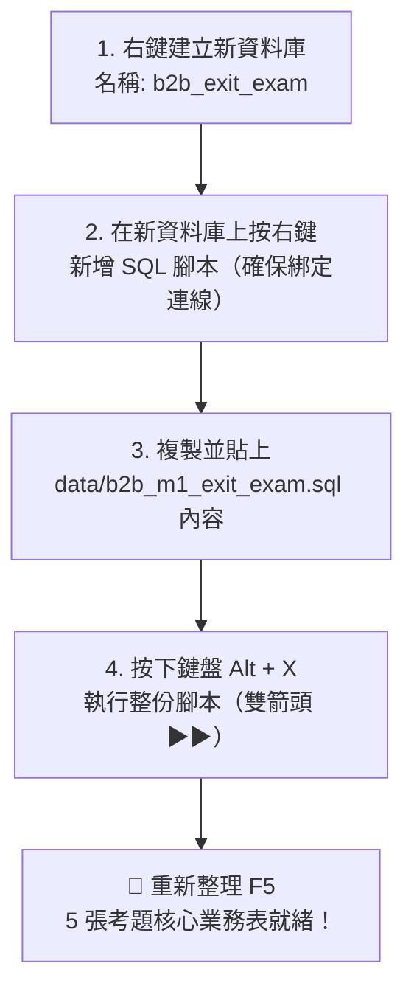

# 🎓 M1 Exit Exam：B2B 商業數據偵探考題

> **「只會打 SELECT 不叫會 SQL，能在 15 分鐘內用數據回答總經理的商業問題，才叫合格的 Data Engineer。」**

歡迎來到 Month 01 的結業驗收試煉！本測驗不是選擇題，而是完全模擬真實 B2B 企業營運現場的「商業調查任務」。

---

## 📋 測驗規則與通過標準 (Pass Criteria)

- ⏱️ **建議時間**：90 分鐘
- 🚫 **AI 使用限制**：**嚴禁使用 AI 直接生成 SQL（Level 0）**。你可以查閱官方文件或語法手冊，但必須由你親手寫出每一道查詢。
- 🎯 **通過標準（需同時滿足）**：
  1. **實作題正確率達 80% 以上**（共 5 題，至少答對 4 題且計算結果正確）。
  2. **必須附帶「商業結論與行動建議」**（不能只有冷冰冰的查詢結果）。
  3. **通過 AI 陷阱除錯題**（精確指出 AI 程式碼的邏輯漏洞）。
  4. **口試題能不看小抄、用白話文向非技術主管解釋清楚**。

---

## 🗄️ 測試資料庫環境建置指南 (Data Schema & Setup)

> [!IMPORTANT]
> ### 🚨 為什麼需要建立獨立資料庫？
> 本結業考備有專屬初始化腳本 [`data/b2b_m1_exit_exam.sql`](./data/b2b_m1_exit_exam.sql)。
> 由於考題資料包含重置指令（`DROP TABLE IF EXISTS ...`），**強烈建議按照下方「方案 A」在 DBeaver 中新增一個獨立的 `b2b_exit_exam` 資料庫**，這樣既不會洗掉你前面 01~09 關卡的練習成果，也能享有乾淨的獨立測驗環境！

---

### 🛠️ 推薦安裝流程：兩分鐘建立考題環境（方案 A：獨立資料庫）

請開啟 **DBeaver**，按照以下 4 步完成資料庫建立：



#### 詳細操作步驟：

1. **新增獨立資料庫**：
   - 在 DBeaver 左側的「資料庫導覽 (Database Navigator)」中，展開你的 PostgreSQL 連線。
   - 找到 **「資料庫 (Databases)」** 目錄，按 **滑鼠右鍵** ➜ 點選 **「建立新資料庫 (Create New Database)」**。
   - 在資料庫名稱欄位輸入：`b2b_exit_exam`，點擊 **「確定」**。
2. **開啟綁定連線的 SQL 編輯器**：
   - 在剛建好的 **`b2b_exit_exam`** 上按 **滑鼠右鍵** ➜ 點選 **「SQL 編輯器 (SQL Editor)」➜「新增 SQL 腳本 (New SQL Script)」**。
   - 檢查編輯器分頁右上角的下拉選單，確認顯示為 `... - b2b_exit_exam`（這能 100% 杜絕「No active connection」未綁定連線的錯誤）。
3. **貼上並執行腳本**：
   - 開啟本專案的專屬初始化腳本 [`data/b2b_m1_exit_exam.sql`](./data/b2b_m1_exit_exam.sql)。
   - 按 `Ctrl + A`（全選）➜ `Ctrl + C`（複製），貼回 DBeaver 的 SQL 編輯器。
   - 按下鍵盤 **`Alt + X`**（或點擊編輯器左側工具列的 **雙箭頭 ▶▶**「執行整份腳本」）。
4. **驗證建表成果**：
   - 展開 `b2b_exit_exam` ➜ `綱要群 (Schemas)` ➜ `public` ➜ `表 (Tables)`，按鍵盤 **`F5`** 重新整理。
   - 確認 5 張資料表與測試資料皆已正確建立！

---

> [!TIP]
> **懶人備用路徑（方案 B：直接覆蓋現有資料庫）**：
> 如果你不需要保留 01~09 關卡的練習表，也可以直接在既有的 `postgres` 資料庫上按右鍵 ➜「新增 SQL 腳本」，貼上該腳本並按 `Alt + X` 執行。原有的舊表會被乾淨替換為考題表。

---

### ❓ 常見報錯排除 (Troubleshooting FAQ)

| 常見報錯問題 | 發生原因 | 解決方法 |
| :--- | :--- | :--- |
| ❌ **`No active connection for this editor`** | 直接點雙擊打開檔案或點了通用圖示，編輯器沒有連線到任何資料庫。 | 請在編輯器工具列右上角下拉選單選擇連線與資料庫，或依照上方步驟在資料庫上「按右鍵 ➜ 新增 SQL 腳本」。 |
| ❌ **`CREATE DATABASE cannot run inside a transaction block`** | 在開啟交易模式下用 SQL 語句建立資料庫所引發的 PostgreSQL 語法限制。 | 請直接使用 DBeaver 左側介面的「資料庫 ➜ 右鍵 ➜ 建立新資料庫」建立，最穩定且不會跳錯。 |
| ❌ **按了執行只跑一行就跳語法錯誤** | 誤按了 `Ctrl + Enter`（單行執行），未執行完整的建表語句。 | 建表腳本包含多張表格與關聯，**務必使用 `Alt + X`（或左側雙箭頭 ▶▶）** 執行整份腳本。 |

---

### 📊 測驗資料庫結構 (Data Schema)


```
[customers] (客戶主表)
- customer_id (PK, INT)
- company_name (VARCHAR)
- industry (VARCHAR: 'SaaS', 'Manufacturing', 'Retail', 'Logistics', 'Healthcare')
- city (VARCHAR)
- created_at (TIMESTAMP)

[sales_reps] (業務代表表)
- rep_id (PK, INT)
- rep_name (VARCHAR)
- region (VARCHAR: 'North', 'Central', 'South')

[products] (產品表)
- product_id (PK, INT)
- product_name (VARCHAR)
- category (VARCHAR)
- unit_price (NUMERIC)

[orders] (訂單主表)
- order_id (PK, INT)
- customer_id (FK -> customers.customer_id)
- rep_id (FK -> sales_reps.rep_id)
- order_date (DATE)
- total_amount (NUMERIC)
- status (VARCHAR: 'Completed', 'Cancelled', 'Refunded')

[order_items] (訂單明細表)
- item_id (PK, INT)
- order_id (FK -> orders.order_id)
- product_id (FK -> products.product_id)
- quantity (INT)
- unit_price (NUMERIC)
- subtotal (NUMERIC)
```

---

## 💻 第一部分：B2B 商業數據偵探實作題 (共 5 題)

### 題目 1：營收與履約健康度檢視
> **業務情境**：營運長需要確認最近一個完整月份（假設分析基準日為 `2024-03-31`，即計算 2024 年 3 月份）的整體經營數字。
- **題目要求**：
  1. 計算 2024 年 3 月期間，狀態為 `'Completed'` 的**總營收（Total Revenue）**與**有效訂單數（Order Count）**。
  2. 同時計算該月份**被取消（Cancelled）或退款（Refunded）的損失金額**。
- **交付成果**：SQL 程式碼 + 兩句話商業結論。

---

### 題目 2：Top 10 旗艦客戶貢獻度分析
> **業務情境**：業務副總要在季度大會上表揚重點客戶，並確保重要客戶沒有流失風險。
- **題目要求**：
  1. 找出全歷史累計消費金額最高（狀態僅限 `'Completed'`）的前 10 名客戶。
  2. 輸出欄位：`company_name`、`industry`、累計消費金額 `total_spent`、累計訂單數 `order_count`、平均客單價 `avg_order_value`。
  3. 依累計消費金額由高至低排序。
- **交付成果**：SQL 程式碼 + 針對 Top 1 客戶的商業維護建議。

---

### 題目 3：高危險沉睡客戶警報 (Churn Alert)
> **業務情境**：B2B 客戶如果超過 90 天未下任何新訂單，流失率會飆升至 70%。業務團隊需要名單進行挽回拜訪。
- **題目要求**：
  - 基準日設為 `2024-03-31`。
  - 找出過去**至少有過一次 Completed 訂單**，但**最後一次下單距離基準日已超過 90 天**的所有客戶。
  - 輸出欄位：`customer_id`、`company_name`、最後一次下單日期 `last_order_date`、沉睡天數 `days_since_last_order`。
  - 依沉睡天數由大到小排序。
- **交付成果**：SQL 程式碼 + 告訴業務團隊應優先聯繫哪一類產業客戶。

---

### 題目 4：業務代表戰力與客單價排行
> **業務情境**：年度績效評核即將展開，管理層想知道業務代表的接單能力與擅長客群。
- **題目要求**：
  1. 列出每一位業務代表姓名（`rep_name`）及其負責區域（`region`）。
  2. 計算每位業務已完成訂單的：總銷售額 `sales_volume`、成交訂單數 `deals_closed`、平均成交金額 `avg_deal_size`。
  3. 即使某些新業務尚未有任何訂單，其名字也必須出現在報表中（銷售額顯示為 0 或 NULL，考察 `LEFT JOIN`）。
- **交付成果**：SQL 程式碼 + 一句管理建議（哪位業務客單價最高？哪位是走薄利多銷路線？）。

---

### 題目 5：長尾滯銷產品盤點
> **業務情境**：倉庫庫存成本過高，供應鏈部門想知道哪些產品在上架後「從來沒有被購買過」或「過去 180 天無人問津」。
- **題目要求**：
  1. 找出歷史上**從未有過任何銷售紀錄**（即沒有出現在 Completed 訂單中）的產品清單。
  2. 輸出欄位：`product_id`、`product_name`、`category`、`unit_price`。
  3. 考察：請至少使用兩種語法之一解答（`LEFT JOIN ... WHERE IS NULL` 或 `NOT EXISTS` / `NOT IN`）。
- **交付成果**：SQL 程式碼 + 庫存清理策略建議。

---

## 🗣️ 第二部分：口試面試題 (Interview Ready)

請以錄音或口頭自述的方式，用非技術主管與工程師皆能理解的語言回答以下 3 題：

1. **WHERE 與 HAVING 的本質差異**：
   - 「為什麼我寫 `WHERE SUM(total_amount) > 50000` 會噴錯？SQL 底層的運算順序（Execution Order）到底是什麼？」
2. **JOIN 導致的資料膨脹（Fan-out trap）**：
   - 「如果有一張訂單表 `orders`（1 萬筆）與訂單明細表 `order_items`（5 萬筆），我想要算每個客戶的總消費金額，先 JOIN 再 GROUP BY，跟先在子查詢 GROUP BY 再 JOIN，會有什麼效能與正確性上的區別？」
3. **三值邏輯與 NULL 陷阱**：
   - 「在 SQL 裡面，為什麼 `WHERE discount_rate <> 0.1` 無法抓出那些 `discount_rate IS NULL` 的資料？身為 Data Engineer，你在實務上會怎麼防呆？」

---

## 🤖 第三部分：AI 陷阱除錯題 (Bug Hunting)

某位實習生向 AI 詢問了一段 SQL，想要計算「每位客戶的總訂單金額與購買產品品項數」：

```sql
-- 實習生提交的 AI 生成程式碼
SELECT 
    c.customer_id,
    c.company_name,
    SUM(o.total_amount) AS total_revenue,
    COUNT(oi.product_id) AS total_items_bought
FROM customers c
LEFT JOIN orders o ON c.customer_id = o.customer_id
LEFT JOIN order_items oi ON o.order_id = oi.order_id
GROUP BY c.customer_id, c.company_name;
```

### 你的任務：
1. **抓出 Bug**：這段 SQL 算出來的 `total_revenue` 是正確的嗎？會發生什麼致命問題？為什麼？
2. **重構修復**：寫出修正後的正確 SQL（提示：注意資料粒度與聚合時機）。

---

## 📝 自我評分與通關簽核 (Sign-off)

- [ ] 題目 1~5 皆能獨立寫出，無語法報錯，結果邏輯正確
- [ ] 每一題都有附上「給主管看的商業結論」
- [ ] 能在不看答案的情況下，口頭清晰回答口試題 1~3
- [ ] 正確指出實習生程式碼中的 Multi-JOIN 笛卡兒積/重疊計算錯誤並給予修復

**評分結果**：_____ / 100
> 通過 80 分以上，恭喜你正式具備 **Month 01: Job Ready (SQL 商業數據偵探)** 認證，獲准進入 **Month 02**！

---

## 🔗 章節導航

- **前一篇（30 題實戰）**：[09_30道B2B商業SQL實戰練習題.md](./09_30道B2B商業SQL實戰練習題.md)
- **回到目錄**：[Month 01 學習模組主導航](./README.md)
- **晉級成果檢驗**：[學習驗收 Checkpoints](../../A2_學習驗收Checkpoints/README.md)
