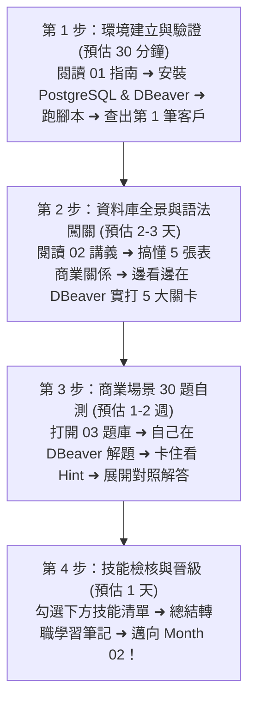

# Month 01｜SQL 基礎：看懂、查詢與篩選企業資料庫

> **本月核心目標**：克服對資料庫的陌生感，在電腦中建立起完整的企業資料庫環境，熟練使用 SQL 核心查詢語法（`SELECT`, `WHERE`, `GROUP BY`, `JOIN`），並能獨立解決 10+ 個真實 B2B 商業資料查詢問題。

---

## 🗺️ Month 01 四步通關學習旅程（Roadmap）

我們將本月拆解為 4 個循序漸進的階段，建議按照順序前進：

---

## 📂 本模組教材文件導航

| 序號 | 篇章名稱 | 核心目標與學習內容 | 預估耗時 |
| :---: | :--- | :--- | :---: |
| **01** | [01_PostgreSQL安裝與環境建立指南.md](./01_PostgreSQL安裝與環境建立指南.md) | 避開 Stack Builder 陷阱、DBeaver 正確綁定連線、匯入資料與完成第一筆查詢驗證 | 30 分鐘 |
| **02** | [02_SQL核心語法精粹_SELECT至JOIN.md](./02_SQL核心語法精粹_SELECT至JOIN.md) | B2B 資料庫 ER 關係圖、5 大階梯式實戰關卡、底層執行順序解密 | 2~3 天 |
| **03** | [03_30道商業場景SQL實戰練習題_含解答.md](./03_30道商業場景SQL實戰練習題_含解答.md) | 30 道涵蓋營收、庫存、業務績效與 VIP 顧客的實戰題（折疊解答，先想再看） | 1~2 週 |
| **資料** | [data/b2b_m1_sample.sql](./data/b2b_m1_sample.sql) | 一鍵建立 5 張資料表（業務、客戶、產品、訂單、明細）的 SQL 初始化腳本 | - |

---

## 🎯 本月技能檢核清單

當你完成本月學習後，請逐項檢查是否能做到：

- [ ] 順利安裝 PostgreSQL 與 DBeaver，能順暢連線本機資料庫。
- [ ] 能在 DBeaver 中開啟 SQL 編輯器，熟練使用快捷鍵 `Alt + X`（腳本）與 `Ctrl + Enter`（單行）。
- [ ] 理解企業資料庫 5 張核心表（客戶、業務、產品、訂單、明細）的關聯邏輯。
- [ ] 掌握 `SELECT` 欄位投影與別名 `AS`。
- [ ] 掌握 `WHERE` 條件篩選（`AND`, `OR`, `IN`, `BETWEEN`, `LIKE`, `ILIKE`）。
- [ ] 掌握 `ORDER BY` 排序與 `LIMIT` 限制輸出筆數。
- [ ] 徹底理解 `NULL` 特性（`IS NULL` vs `= NULL` 的世紀大坑）。
- [ ] 熟練 5 大聚合函數：`COUNT`, `SUM`, `AVG`, `MAX`, `MIN`。
- [ ] 深入理解 `GROUP BY` 分組機制與 `HAVING` 聚合後過濾的區別。
- [ ] 能用白話解釋 SQL「書寫順序」與「底層執行順序」的差異。
- [ ] 掌握條件分類標籤 `CASE WHEN ... THEN ... ELSE ... END`。
- [ ] 掌握 `INNER JOIN`（交集）與 `LEFT JOIN`（保留左表）的差異與應用場景。
- [ ] 獨立完成 03 題庫中至少 20 道題目以上。

---

## 🚀 學習建議與疑難排解

- **卡關時不要慌張**：遇到報錯時，先看錯誤訊息最後一行的提示（例如是不是拼錯欄位名稱？是不是漏了單引號？）。
- **善用 DBeaver 的自動補全**：打出前幾個字母後按鍵盤 `Ctrl + Space`，DBeaver 會自動提示資料表或欄位名稱。
- **隨時紀錄痛點**：將你寫 SQL 時遇到的盲區記錄在筆記本中，這將成為你未來面試時最有價值的「踩坑與解決問題的故事」。
