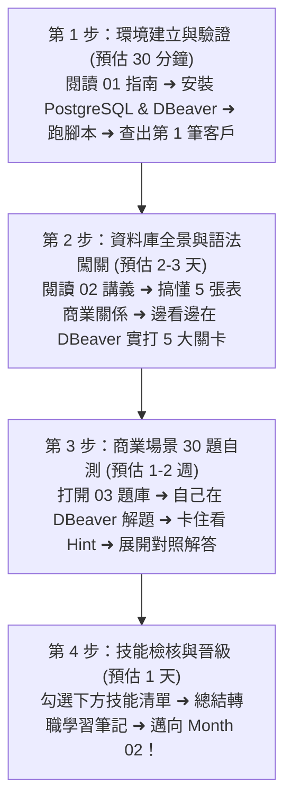

# Month 01｜SQL 基礎：看懂、查詢與篩選企業資料庫

> **本月核心目標**：克服對資料庫的陌生感，在電腦中建立起完整的企業資料庫環境，熟練使用 SQL 核心查詢語法（`SELECT`, `WHERE`, `GROUP BY`, `JOIN`），並能獨立解決 10+ 個真實 B2B 商業資料查詢問題。

---

## 🗺️ Month 01 四步通關學習旅程（Roadmap）

我們將本月拆解為 4 個循序漸進的階段，建議按照順序前進：

---

## 📂 本模組教材文件導航

| 序號 | 篇章名稱 | 核心目標與學習內容 | 預估耗時 |
| :---: | :--- | :--- | :---: |
| **01** | [01_環境建置_PostgreSQL安裝與DBeaver連線.md](./01_環境建置_PostgreSQL安裝與DBeaver連線.md) | 避開 Stack Builder 陷阱、DBeaver 正確綁定連線、匯入資料與完成第一筆查詢驗證 | 30 分鐘 |
| **02** | [02_本月學習計畫與目標.md](./02_本月學習計畫與目標.md) | 四週每日學習計畫、本月目標設定與節奏規劃 | 15 分鐘 |
| **03** | [03_SQL核心語法_SELECT到JOIN全解析.md](./03_SQL核心語法_SELECT到JOIN全解析.md) | B2B 資料庫 ER 關係圖、5 大階梯式實戰關卡、底層執行順序解密 | 2~3 天 |
| **04** | [04_SQL商業問題拆解框架.md](./04_SQL商業問題拆解框架.md) | 看到商業需求如何拆解成 SQL 的系統化思維框架 | 1 天 |
| **05** | [05_JOIN陷阱與資料粒度問題.md](./05_JOIN陷阱與資料粒度問題.md) | Data Grain 概念、JOIN 後資料重複的根源與防範 | 1 天 |
| **06** | [06_30道B2B商業SQL實戰練習題.md](./06_30道B2B商業SQL實戰練習題.md) | 30 道涵蓋營收、庫存、業務績效與 VIP 顧客的實戰題（折疊解答，先想再看） | 1~2 週 |
| **07** | [07_SQL除錯方法論.md](./07_SQL除錯方法論.md) | 系統化 SQL Debug 流程、常見錯誤類型與排除方法 | 0.5 天 |
| **08** | [08_讀懂陌生資料庫的五步驟.md](./08_讀懂陌生資料庫的五步驟.md) | 面對新資料庫的探索 SOP：PK/FK/Grain/髒資料偵測 | 1 天 |
| **09** | [09_AI協助SQL複習工作流.md](./09_AI協助SQL複習工作流.md) | 用 AI 加速 SQL 學習與 Code Review 的標準流程 | 0.5 天 |
| **10** | [10_Exit_Exam_B2B商業數據偵探考題.md](./10_Exit_Exam_B2B商業數據偵探考題.md) | 🎓 **本月結業測驗**：5大商業實作題、口試題與 AI 除錯挑戰（80分晉級） | 1.5 小時 |
| **資料** | [data/b2b_m1_sample.sql](./data/b2b_m1_sample.sql) | 一鍵建立 5 張資料表（業務、客戶、產品、訂單、明細）的 SQL 初始化腳本 | - |

---

## 🎓 本月晉級檢核：Exit Exam 80 分線

進入 M2 之前，你必須通過 [10_Exit_Exam_B2B商業數據偵探考題.md](./10_Exit_Exam_B2B商業數據偵探考題.md) 的實戰考核：
- [ ] 達成 **Level 2 (Job Ready)**：不看答案能獨立寫出 Top 10 客戶、90天未下單客戶等 5 道商業查詢。
- [ ] 能給出商業結論與行動建議（不是只給數字）。
- [ ] 能口頭回答 execution order、JOIN 膨脹與 NULL 陷阱。
- [ ] 成功找出並修復 AI 生成 SQL 中的 Fan-out 重複計算問題。

---

## 🎯 本月技能檢核清單

當你完成本月學習後，請逐項檢查是否能做到：

- [ ] 順利安裝 PostgreSQL 與 DBeaver，能順暢連線本機資料庫。
- [ ] 能在 DBeaver 中開啟 SQL 編輯器，熟練使用快捷鍵 `Alt + X`（腳本）與 `Ctrl + Enter`（單行）。
- [ ] 理解企業資料庫 5 張核心表（客戶、業務、產品、訂單、明細）的關聯邏輯。
- [ ] 掌握 `SELECT` 欄位投影與別名 `AS`。
- [ ] 掌握 `WHERE` 條件篩選（`AND`, `OR`, `IN`, `BETWEEN`, `LIKE`, `ILIKE`）。
- [ ] 掌握 `ORDER BY` 排序與 `LIMIT` 限制輸出筆數。
- [ ] 徹底理解 `NULL` 特性（`IS NULL` vs `= NULL` 的世紀大坑）。
- [ ] 熟練 5 大聚合函數：`COUNT`, `SUM`, `AVG`, `MAX`, `MIN`。
- [ ] 深入理解 `GROUP BY` 分組機制與 `HAVING` 聚合後過濾的區別。
- [ ] 能用白話解釋 SQL「書寫順序」與「底層執行順序」的差異。
- [ ] 掌握條件分類標籤 `CASE WHEN ... THEN ... ELSE ... END`。
- [ ] 掌握 `INNER JOIN`（交集）與 `LEFT JOIN`（保留左表）的差異與應用場景。
- [ ] 獨立完成 03 題庫中至少 20 道題目以上。

---

## 🚀 學習建議與疑難排解

- **卡關時不要慌張**：遇到報錯時，先看錯誤訊息最後一行的提示（例如是不是拼錯欄位名稱？是不是漏了單引號？）。
- **善用 DBeaver 的自動補全**：打出前幾個字母後按鍵盤 `Ctrl + Space`，DBeaver 會自動提示資料表或欄位名稱。
- **隨時紀錄痛點**：將你寫 SQL 時遇到的盲區記錄在筆記本中，這將成為你未來面試時最有價值的「踩坑與解決問題的故事」。
