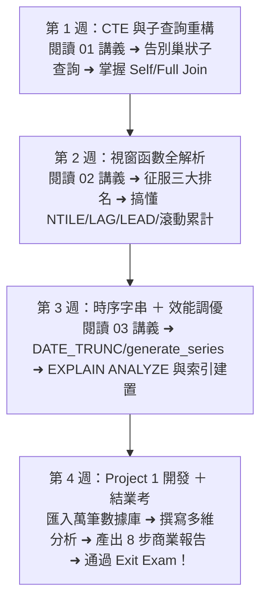

# Month 02｜SQL 進階與分析：從「查資料」升級到「商業數據分析」

> **本月核心目標**：掌握進階 SQL 分析工具（CTE、Window Functions、日期函數與查詢效能優化），並完成生平第一個可放上 GitHub 的 **10,000+ 筆銷售數據多維度分析專案 (Project 1)**。

---

## 🗺️ Month 02 四步進階學習旅程（Roadmap）

我們將本月拆解為 4 個循序漸進的衝刺階段：

---

## 📂 本模組教材文件導航

| 序號 | 篇章名稱 | 核心目標與學習內容 | 推薦時機 |
| :---: | :--- | :--- | :---: |
| **00** | [00_本月學習計畫與目標.md](./00_本月學習計畫與目標.md) | 📅 **4 週 28 天每日學習排程**、Git Commit 規範與驗收標準 | 開學第一天必讀 |
| **01** | [01_Subquery_CTE與進階JOIN.md](./01_Subquery_CTE與進階JOIN.md) | 純量與相關子查詢、CTE 模組化寫法、Self Join 與 Full Outer Join | 第 1 週 |
| **02** | [02_Window_Functions全解析.md](./02_Window_Functions全解析.md) | 視窗函數原理、三大排名 (Top N)、月增率 (MoM)、同期年增率 (YoY)、累計營收 | 第 2 週 |
| **03** | [03_日期字串處理與效能優化入門.md](./03_日期字串處理與效能優化入門.md) | 日期區間計算、字串正規清洗、EXPLAIN ANALYZE 執行計畫與 B-Tree 索引避坑 | 第 3 週 |
| **04** | [04_Exit_Exam_與面試規格升級指南.md](./04_Exit_Exam_與面試規格升級指南.md) | 🎓 **結業測驗**：MoM 滾動增長率、RFM 分群、口試考題 🚀 **Project 1 面試化重構指南**：8 步商業敘事報告架構 | 第 4 週 |
| **專案** | [Project_01_銷售資料多維度分析專案/](./Project_01_銷售資料多維度分析專案/README.md) | 🏆 **第一個開源作品**：建表腳本、10,000+ 筆資料生成、分析 SQL 與商業報告範本 | 第 4 週 |

---

## 🎯 本月技能檢核清單

當你完成本月學習後，請逐項檢查是否能做到：

- [ ] 理解標量子查詢 (Scalar Subquery) 與相關子查詢 (Correlated Subquery) 的執行差異。
- [ ] 熟練使用 CTE (Common Table Expression - `WITH ... AS`) 模組化複雜查詢。
- [ ] 徹底掌握三大排名函數：`ROW_NUMBER()`, `RANK()`, `DENSE_RANK()` 的同分處理。
- [ ] 掌握時序位移函數：`LAG()`, `LEAD()` 計算週期成長率與下單間隔。
- [ ] 掌握動態累積計算：`SUM(...) OVER (PARTITION BY ... ORDER BY ...)`。
- [ ] 熟練 PostgreSQL 日期處理：`DATE_TRUNC`, `AGE`, `INTERVAL`, `EXTRACT` 與 `generate_series`。
- [ ] 掌握常用字串清洗：`TRIM`, `SPLIT_PART`, `REPLACE`, `REGEXP_REPLACE`。
- [ ] 認識 Index 索引原理（B-Tree 結構）與能用 `EXPLAIN ANALYZE` 讀懂執行計畫。
- [ ] 完成 **Project 1：銷售資料多維度分析專案** 並推上 GitHub，附有高質感 README。
- [ ] 閉卷通過 **04_Exit_Exam** 考核（得分達 80 分以上）。
