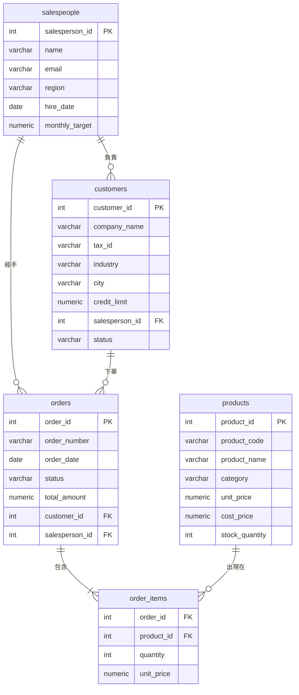

# 01 關聯式資料庫設計規範與正規化

> **寫在前面：為什麼要學資料庫設計？**
> 很多人以為「會查詢 SQL 就夠了」，但在實際工作中，你很快會遇到這樣的問題：
> - 同一個客戶的電話存在三個地方，改了一個、忘了改另外兩個
> - 刪除一筆訂單，同時把客戶資訊也刪掉了
> - 新增一筆產品，卻因為還沒有對應的訂單而無法儲存
>
> 這些問題都源自**糟糕的資料庫設計**。本篇帶你學習正規化，從根本解決這類問題。
>
> 📌 本篇理論較重，建議搭配紙筆畫圖，真正理解每個正規化的意涵。

---

## 🗺️ 本篇學習地圖

```
資料異常（Anomaly）的三種類型
  ├── 新增異常（Insertion Anomaly）
  ├── 刪除異常（Deletion Anomaly）
  └── 更新異常（Update Anomaly）

函數相依（Functional Dependency）
  └── 理解正規化的理論基礎

正規化（Normalization）
  ├── 第一正規形式（1NF）
  ├── 第二正規形式（2NF）
  ├── 第三正規形式（3NF）
  └── BCNF（Boyce-Codd Normal Form）

反正規化（Denormalization）
  └── 什麼時候應該犧牲正規化換取效能？

ER Diagram 繪製實戰
  └── 以 B2B 銷售系統為例
```

---

## 一、先從「糟糕設計」看問題

在學正規化之前，先看一張**設計很糟的訂單表**（將所有資訊塞在同一張表）：

```
訂單超級大表（order_mega_table）
┌──────────┬─────────────────┬──────────────────────┬──────────┬──────────────┬──────────────┬────────────┬────────────┬───────────────┬────────────┐
│ order_id │ order_number    │ customer_company_name│ customer │ salesperson_ │ salesperson_ │ product_   │ product_   │ product_      │ quantity   │
│          │                 │                      │ _city    │ name         │ region       │ code       │ name       │ unit_price    │            │
├──────────┼─────────────────┼──────────────────────┼──────────┼──────────────┼──────────────┼────────────┼────────────┼───────────────┼────────────┤
│    1     │  ORD-2024-001   │  台灣半導體股份有限公司  │  台北市  │   王小明      │   北區        │  SRV-001   │  企業伺服器  │   299,000     │    2       │
│    1     │  ORD-2024-001   │  台灣半導體股份有限公司  │  台北市  │   王小明      │   北區        │  SEC-001   │  資安防火牆  │    89,000     │    1       │
│    2     │  ORD-2024-002   │  台灣半導體股份有限公司  │  台北市  │   王小明      │   北區        │  SW-003    │  ERP軟體授權 │   150,000     │    5       │
└──────────┴─────────────────┴──────────────────────┴──────────┴──────────────┴──────────────┴────────────┴────────────┴───────────────┴────────────┘
```

**這張表有哪些問題？**

### 1. 更新異常（Update Anomaly）
「台灣半導體股份有限公司」搬到高雄了，需要把 `customer_city` 改為「高雄市」。但這家公司有 50 筆訂單，就要改 50 列——漏改一列就造成資料不一致。

### 2. 新增異常（Insertion Anomaly）
想新增一個產品「AI 伺服器」，但因為還沒有任何訂單使用這個產品，**不知道要填什麼 `order_id`**，無法新增。

### 3. 刪除異常（Deletion Anomaly）
刪除了唯一一筆購買「ERP軟體授權」的訂單（order_id = 2），結果這個產品的所有資訊也一起消失了！

---

## 二、函數相依（Functional Dependency）

正規化的理論基礎是「函數相依」，用一句話理解：

> **如果知道欄位 A 的值，就能唯一確定欄位 B 的值，就說 B 函數相依於 A，記作 A → B**

**B2B 資料庫的函數相依例子**：
- `order_id → order_number`（知道訂單 ID，就能唯一確定訂單號碼）
- `order_id → customer_id`（一筆訂單對應一個客戶）
- `customer_id → company_name`（一個客戶對應一個公司名稱）
- `product_id → unit_price`（一個產品有固定售價）
- `(order_id, product_id) → quantity`（一筆訂單中某產品的數量，需要兩個欄位才能唯一確定）

---

## 三、第一正規形式（1NF）

### 規則

> **每一個欄位的值必須是不可再分割的「原子值」（Atomic Value）；同一個欄位不能有多個值。**

### ❌ 違反 1NF 的設計

```
customers_bad（違反 1NF）
┌─────────────┬──────────────────────┬───────────────────────────────────┐
│ customer_id │ company_name         │ phone_numbers（一格多值！）         │
├─────────────┼──────────────────────┼───────────────────────────────────┤
│      1      │  台灣半導體股份有限公司  │  02-2345-6789, 02-9876-5432       │
│      2      │  智慧雲端科技有限公司   │  04-1234-5678                     │
└─────────────┴──────────────────────┴───────────────────────────────────┘
```

問題：`phone_numbers` 欄位存了多個電話號碼，無法直接查詢「電話以 02 開頭的客戶」。

### ✅ 符合 1NF 的設計

```sql
-- 拆出獨立的電話表
CREATE TABLE customer_phones (
    phone_id    SERIAL PRIMARY KEY,
    customer_id INT REFERENCES customers(customer_id),
    phone_type  VARCHAR(20),   -- 'office', 'mobile', 'fax'
    phone_number VARCHAR(20) NOT NULL
);
```

```
customer_phones（符合 1NF）
┌──────────┬─────────────┬────────────┬──────────────┐
│ phone_id │ customer_id │ phone_type │ phone_number │
├──────────┼─────────────┼────────────┼──────────────┤
│    1     │      1      │  office    │ 02-2345-6789 │
│    2     │      1      │  fax       │ 02-9876-5432 │
│    3     │      2      │  office    │ 04-1234-5678 │
└──────────┴─────────────┴────────────┴──────────────┘
```

**1NF 的實作要點**：
- 每欄位一個值
- 同一類資料不能拆成多欄（如 `phone1`, `phone2`, `phone3` 也是違反 1NF 精神）
- 每列都要有可識別的主鍵

---

## 四、第二正規形式（2NF）

### 規則

> **必須先符合 1NF，且所有非主鍵欄位必須「完全函數相依」於整個主鍵（不能只相依於主鍵的一部分）。**

> ⚠️ 2NF 只在主鍵是「複合主鍵」（多個欄位組成）時才有意義。

### ❌ 違反 2NF 的設計

```
order_items_bad（複合主鍵：order_id + product_id）
┌──────────┬────────────┬──────────┬────────────────┬──────────────┐
│ order_id │ product_id │ quantity │ product_name   │ unit_price   │
├──────────┼────────────┼──────────┼────────────────┼──────────────┤
│    1     │    101     │    2     │  企業伺服器     │   299,000    │
│    1     │    205     │    1     │  資安防火牆     │    89,000    │
│    2     │    101     │    5     │  企業伺服器     │   299,000    │
└──────────┴────────────┴──────────┴────────────────┴──────────────┘
```

**問題**：
- `product_name` 和 `unit_price` 只相依於 `product_id`，不相依於 `order_id`
- → 這叫做「部分相依」（Partial Dependency），違反 2NF
- → 後果：若企業伺服器改名，要改很多列

### ✅ 符合 2NF：拆成兩張表

```sql
-- order_items：只放和「這筆訂單中的這個產品」相關的資訊
CREATE TABLE order_items (
    order_id    INT REFERENCES orders(order_id),
    product_id  INT REFERENCES products(product_id),
    quantity    INT NOT NULL,
    unit_price  NUMERIC(12, 2) NOT NULL,  -- 下單時的成交價（可能和現在的定價不同）
    PRIMARY KEY (order_id, product_id)
);

-- products：產品的固有資訊獨立存放
CREATE TABLE products (
    product_id   SERIAL PRIMARY KEY,
    product_code VARCHAR(20) UNIQUE NOT NULL,
    product_name VARCHAR(200) NOT NULL,
    category     VARCHAR(50),
    unit_price   NUMERIC(12, 2),          -- 目前的定價
    cost_price   NUMERIC(12, 2),
    stock_quantity INT DEFAULT 0
);
```

> 💡 **注意**：`order_items.unit_price` 存的是「成交當下的價格」，而不是 `products.unit_price`（現在的定價）。這是刻意的設計——產品漲價後，歷史訂單的金額不應該跟著變。

---

## 五、第三正規形式（3NF）

### 規則

> **必須先符合 2NF，且所有非主鍵欄位必須直接相依於主鍵，不能透過其他非主鍵欄位間接相依（禁止「遞移相依」Transitive Dependency）。**

### ❌ 違反 3NF 的設計

```
orders_bad（主鍵：order_id）
┌──────────┬──────────────┬─────────────┬──────────────────────┬────────────────┐
│ order_id │ customer_id  │ order_date  │ customer_company_name│ customer_city  │
├──────────┼──────────────┼─────────────┼──────────────────────┼────────────────┤
│    1     │      5       │ 2024-01-15  │  台灣半導體股份有限公司  │    台北市       │
│    2     │      5       │ 2024-02-20  │  台灣半導體股份有限公司  │    台北市       │
│    3     │      8       │ 2024-03-10  │  智慧雲端科技有限公司   │    新竹市       │
└──────────┴──────────────┴─────────────┴──────────────────────┴────────────────┘
```

**相依鏈**：
```
order_id → customer_id → customer_company_name
order_id → customer_id → customer_city
```

`customer_company_name` 和 `customer_city` 是透過 `customer_id` 間接相依於 `order_id`，這就是「遞移相依」，違反 3NF。

### ✅ 符合 3NF：把客戶資訊移到 customers 表

```sql
-- orders：只記錄訂單本身的事實，客戶詳情用 FK 關聯
CREATE TABLE orders (
    order_id       SERIAL PRIMARY KEY,
    order_number   VARCHAR(20) UNIQUE NOT NULL,
    order_date     DATE NOT NULL DEFAULT CURRENT_DATE,
    status         VARCHAR(20) NOT NULL DEFAULT 'PENDING',
    total_amount   NUMERIC(14, 2),
    customer_id    INT NOT NULL REFERENCES customers(customer_id),
    salesperson_id INT REFERENCES salespeople(salesperson_id)
);

-- customers：客戶資訊集中管理，只需維護一處
CREATE TABLE customers (
    customer_id   SERIAL PRIMARY KEY,
    company_name  VARCHAR(200) NOT NULL,
    tax_id        VARCHAR(10),
    industry      VARCHAR(50),
    city          VARCHAR(50),
    credit_limit  NUMERIC(14, 2) DEFAULT 0,
    status        VARCHAR(20) NOT NULL DEFAULT 'ACTIVE'
);
```

---

## 六、BCNF（Boyce-Codd Normal Form）

### 規則

> **必須先符合 3NF，且每一個「決定因素」（Determinant）都必須是候選鍵（Candidate Key）。**

BCNF 是 3NF 的強化版，處理 3NF 遺漏的少數邊界情況，在實務上比較罕見，但理解原理很重要。

**情境示例**：排班表

```
scheduling（一個教室在某個時段只能由一位老師授課；一位老師在一個時段只在一個教室）

(classroom, time_slot) → teacher   ← 複合主鍵
teacher, time_slot → classroom     ← teacher 是決定因素，但不是主鍵的一部分

  ↓

違反 BCNF！應拆分為：
teacher_schedule(teacher_id, time_slot) → classroom_id
```

在 B2B 資料庫中，我們的設計已達到 BCNF，所以不需要特別處理。

---

## 七、正規化 vs 反正規化的抉擇

### 7.1 何時考慮反正規化？

完全正規化的資料庫在**查詢時需要大量 JOIN**，對報表效能有影響。以下情況可以考慮反正規化：

| 情況 | 反正規化策略 | 代價 |
|------|------------|------|
| 頻繁需要客戶城市統計，但每次都要 JOIN | 在 `orders` 加一欄 `customer_city_snapshot` | 更新客戶城市時要同步更新訂單 |
| 儀表板每次都要計算訂單總金額 | 建立 Materialized View | 資料有延遲（不是即時的） |
| 歷史報表查詢超過 5 秒 | 建立彙總表（Summary Table） | 需要定期 ETL 更新 |

### 7.2 常見的反正規化策略

```sql
-- 策略一：Materialized View（物化視圖）
-- 把常用的複雜查詢結果「固化」為一張表，定期刷新
CREATE MATERIALIZED VIEW mv_monthly_sales AS
SELECT
    DATE_TRUNC('month', o.order_date)::date  AS month,
    s.salesperson_id,
    s.name,
    s.region,
    COUNT(DISTINCT o.order_id)               AS order_count,
    SUM(o.total_amount)                      AS revenue
FROM orders o
JOIN salespeople s ON o.salesperson_id = s.salesperson_id
WHERE o.status = 'COMPLETED'
GROUP BY DATE_TRUNC('month', o.order_date), s.salesperson_id, s.name, s.region;

-- 建立索引加速查詢
CREATE INDEX ON mv_monthly_sales(month, salesperson_id);

-- 刷新物化視圖（手動或排程執行）
REFRESH MATERIALIZED VIEW mv_monthly_sales;

-- 查詢物化視圖（速度極快，不需要即時 JOIN）
SELECT * FROM mv_monthly_sales WHERE month >= '2024-01-01';
```

```sql
-- 策略二：Summary Table（彙總表）+ ETL 更新
CREATE TABLE summary_customer_stats (
    customer_id         INT PRIMARY KEY REFERENCES customers(customer_id),
    total_orders        INT DEFAULT 0,
    total_spending      NUMERIC(14, 2) DEFAULT 0,
    last_order_date     DATE,
    customer_tier       VARCHAR(20),
    updated_at          TIMESTAMP DEFAULT NOW()
);

-- 每日凌晨 2 點由排程 ETL 更新（在 Month05 會學如何自動化）
INSERT INTO summary_customer_stats
SELECT
    c.customer_id,
    COUNT(DISTINCT o.order_id),
    COALESCE(SUM(o.total_amount), 0),
    MAX(o.order_date),
    CASE NTILE(4) OVER (ORDER BY COALESCE(SUM(o.total_amount), 0) ASC)
        WHEN 4 THEN 'GOLD'
        WHEN 3 THEN 'SILVER'
        WHEN 2 THEN 'BRONZE'
        ELSE 'REGULAR'
    END
FROM customers c
LEFT JOIN orders o ON c.customer_id = o.customer_id AND o.status = 'COMPLETED'
WHERE c.status = 'ACTIVE'
GROUP BY c.customer_id
ON CONFLICT (customer_id) DO UPDATE
SET
    total_orders    = EXCLUDED.total_orders,
    total_spending  = EXCLUDED.total_spending,
    last_order_date = EXCLUDED.last_order_date,
    customer_tier   = EXCLUDED.customer_tier,
    updated_at      = NOW();
```

---

## 八、ER Diagram 繪製實戰

### 8.1 ER Diagram 符號說明

```
實體（Entity）：矩形框框，代表一個「資料表」
屬性（Attribute）：實體的欄位
關係（Relationship）：實體之間的連結線

基數（Cardinality）符號：
  ||  — 一個（One）
  o{  — 零個或多個（Zero or Many）
  ||{ — 一個或多個（One or Many）
  |o  — 零個或一個（Zero or One）
```

### 8.2 B2B 銷售系統 ER Diagram



### 8.3 各種關係的 SQL 實作

```sql
-- 一對多（One-to-Many）：一位業務負責多位客戶
-- 在「多」的那側放 FK
ALTER TABLE customers
    ADD CONSTRAINT fk_customers_salesperson
    FOREIGN KEY (salesperson_id) REFERENCES salespeople(salesperson_id)
    ON UPDATE CASCADE     -- 主鍵更新時，FK 跟著更新
    ON DELETE SET NULL;   -- 業務離職時，客戶的 salesperson_id 設為 NULL（而非刪除客戶）

-- 多對多（Many-to-Many）：一筆訂單有多個產品；一個產品出現在多筆訂單
-- 透過「關聯表」（Junction Table）實現
-- order_items 就是 orders 和 products 的關聯表
ALTER TABLE order_items
    ADD CONSTRAINT fk_order_items_order
    FOREIGN KEY (order_id) REFERENCES orders(order_id)
    ON DELETE CASCADE,    -- 訂單刪除時，訂單明細也跟著刪除

    ADD CONSTRAINT fk_order_items_product
    FOREIGN KEY (product_id) REFERENCES products(product_id)
    ON DELETE RESTRICT;   -- 有訂單明細引用此產品時，禁止刪除產品
```

---

## 九、設計一個新功能：加入「客戶聯絡人」模組

**需求**：一個 B2B 客戶通常有多個聯絡人（採購主管、IT 主管、財務主管...），需要設計資料表支援。

**分析**：
- 客戶 : 聯絡人 = 1 : 多
- 每個聯絡人有姓名、職稱、電話、Email
- 需要標記「主要聯絡人」

```sql
-- 設計：獨立的 customer_contacts 表
CREATE TABLE customer_contacts (
    contact_id      SERIAL PRIMARY KEY,
    customer_id     INT NOT NULL REFERENCES customers(customer_id) ON DELETE CASCADE,
    contact_name    VARCHAR(100) NOT NULL,
    title           VARCHAR(100),              -- 職稱
    department      VARCHAR(100),              -- 部門
    email           VARCHAR(200),
    phone           VARCHAR(30),
    is_primary      BOOLEAN DEFAULT FALSE,     -- 是否為主要聯絡人
    created_at      TIMESTAMP DEFAULT NOW()
);

-- 業務規則：每個客戶最多只有一個主要聯絡人
-- 用部分唯一索引實現（只對 is_primary = TRUE 的列加唯一約束）
CREATE UNIQUE INDEX idx_one_primary_contact_per_customer
ON customer_contacts(customer_id)
WHERE is_primary = TRUE;

-- 查詢：列出所有客戶的主要聯絡人
SELECT
    c.company_name,
    cc.contact_name,
    cc.title,
    cc.email,
    cc.phone
FROM customers c
LEFT JOIN customer_contacts cc
    ON c.customer_id = cc.customer_id
    AND cc.is_primary = TRUE
WHERE c.status = 'ACTIVE'
ORDER BY c.company_name;
```

---

## 十、練習題

### 題目 1：找出違反 1NF 的欄位並修正設計

**情境**：以下是一個原始的採購紀錄表，找出問題並寫出符合 1NF 的設計。

```
purchase_orders_raw
┌────────┬──────────────────────┬─────────────────────────────────────┬──────────┐
│ po_id  │ supplier_name        │ items（格式：產品代號:數量,產品代號:數量）│ total    │
├────────┼──────────────────────┼─────────────────────────────────────┼──────────┤
│   1    │  台灣伺服器代理商      │  SRV-001:10, SEC-002:5              │ 3,190,000│
│   2    │  全球資安解決方案公司  │  SEC-001:3, SEC-002:8               │   980,000│
└────────┴──────────────────────┴─────────────────────────────────────┴──────────┘
```

**解答**：

問題：`items` 欄位違反 1NF（一格多值，且每個值還是複合結構「程式碼:數量」）

```sql
-- 符合 1NF 的設計
CREATE TABLE purchase_orders (
    po_id         SERIAL PRIMARY KEY,
    supplier_name VARCHAR(200) NOT NULL,
    po_date       DATE DEFAULT CURRENT_DATE,
    total_amount  NUMERIC(14, 2)
);

CREATE TABLE purchase_order_items (
    po_id         INT REFERENCES purchase_orders(po_id) ON DELETE CASCADE,
    product_code  VARCHAR(20) REFERENCES products(product_code),
    quantity      INT NOT NULL CHECK (quantity > 0),
    unit_cost     NUMERIC(12, 2) NOT NULL,
    PRIMARY KEY (po_id, product_code)
);
```

---

### 題目 2：識別 2NF 違反並修正

**情境**：以下的 `student_course` 表（複合主鍵：student_id + course_id）有哪些欄位違反 2NF？

```
student_courses（PK = student_id + course_id）
┌────────────┬───────────┬───────────────┬──────────────────┬────────────────┐
│ student_id │ course_id │ grade         │ course_name      │ instructor     │
├────────────┼───────────┼───────────────┼──────────────────┼────────────────┤
│    S001    │   C001    │     A         │  資料庫設計        │   陳教授        │
│    S001    │   C002    │     B+        │  演算法            │   林教授        │
│    S002    │   C001    │     A-        │  資料庫設計        │   陳教授        │
└────────────┴───────────┴───────────────┴──────────────────┴────────────────┘
```

**解答**：

- `course_name` 只相依於 `course_id`（部分相依）→ 違反 2NF
- `instructor` 只相依於 `course_id`（部分相依）→ 違反 2NF
- `grade` 相依於 `(student_id, course_id)`（完全相依）→ 符合 2NF

```sql
-- 修正：拆出 courses 表
CREATE TABLE courses (
    course_id   VARCHAR(10) PRIMARY KEY,
    course_name VARCHAR(200) NOT NULL,
    instructor  VARCHAR(100)
);

CREATE TABLE student_courses (
    student_id  VARCHAR(10),
    course_id   VARCHAR(10) REFERENCES courses(course_id),
    grade       VARCHAR(5),
    PRIMARY KEY (student_id, course_id)
);
```

---

### 題目 3：設計「報價單」功能的資料表

**需求**：B2B 系統新增「報價單（Quotation）」功能。業務可以在成交前先給客戶一份報價，確認後才轉為正式訂單。

需包含：
- 報價單基本資訊（報價日期、有效期、客戶、業務）
- 報價明細（多個產品、各自的報價數量與單價）
- 報價狀態（草稿/已送出/已接受/已過期/已轉訂單）
- 可從報價單一鍵「轉換」為訂單

**解答**：

```sql
-- 報價單主表
CREATE TABLE quotations (
    quotation_id    SERIAL PRIMARY KEY,
    quotation_number VARCHAR(20) UNIQUE NOT NULL,  -- 例：QUO-2024-001
    issue_date      DATE NOT NULL DEFAULT CURRENT_DATE,
    valid_until     DATE NOT NULL,                 -- 有效期限
    status          VARCHAR(20) NOT NULL DEFAULT 'DRAFT'
                    CHECK (status IN ('DRAFT','SENT','ACCEPTED','EXPIRED','CONVERTED')),
    customer_id     INT NOT NULL REFERENCES customers(customer_id),
    salesperson_id  INT REFERENCES salespeople(salesperson_id),
    notes           TEXT,
    total_amount    NUMERIC(14, 2) GENERATED ALWAYS AS STORED
                    -- 注意：PostgreSQL 13+ 才支援 Generated Column
                    -- 實務上通常用 trigger 或 application 計算
);

-- 報價明細表
CREATE TABLE quotation_items (
    quotation_id    INT REFERENCES quotations(quotation_id) ON DELETE CASCADE,
    product_id      INT REFERENCES products(product_id),
    quantity        INT NOT NULL CHECK (quantity > 0),
    quoted_price    NUMERIC(12, 2) NOT NULL,        -- 本次報價的特殊價格
    discount_rate   NUMERIC(5, 2) DEFAULT 0,        -- 折扣率（0~100）
    PRIMARY KEY (quotation_id, product_id)
);

-- 追蹤「報價單 → 訂單」的轉換關係
ALTER TABLE orders
    ADD COLUMN quotation_id INT REFERENCES quotations(quotation_id);

-- 查詢：已接受但尚未轉為訂單的報價單
SELECT
    q.quotation_number,
    c.company_name,
    q.valid_until,
    CURRENT_DATE - q.valid_until AS 過期天數
FROM quotations q
JOIN customers c ON q.customer_id = c.customer_id
WHERE q.status = 'ACCEPTED'
  AND NOT EXISTS (
      SELECT 1 FROM orders o WHERE o.quotation_id = q.quotation_id
  )
ORDER BY q.valid_until;
```

---

## 十一、本章重點彙整

```
資料異常的三種類型
  更新異常：同一資訊存多處，改了一個漏了別處
  新增異常：需要不相關資訊才能新增資料
  刪除異常：刪除一筆資料，意外刪掉其他資訊

正規化四個階段
  1NF：每格一個值，禁止重複群組
  2NF：非主鍵欄位完全相依於整個複合主鍵（禁止部分相依）
  3NF：禁止遞移相依（A→B→C，C要直接依賴主鍵A）
  BCNF：每個決定因素都必須是候選鍵

反正規化的工具
  Materialized View：固化查詢結果，定期刷新
  Summary Table：預先計算的彙總表
  適用於讀多寫少的報表場景

ER Diagram
  實體：資料表
  屬性：欄位
  關係：FK 連結，注意 ON DELETE 行為（CASCADE/SET NULL/RESTRICT）
```

---

*下一篇：[02 Index 索引原理與 ACID 交易機制](./02_Index索引原理與ACID交易機制.md)*
