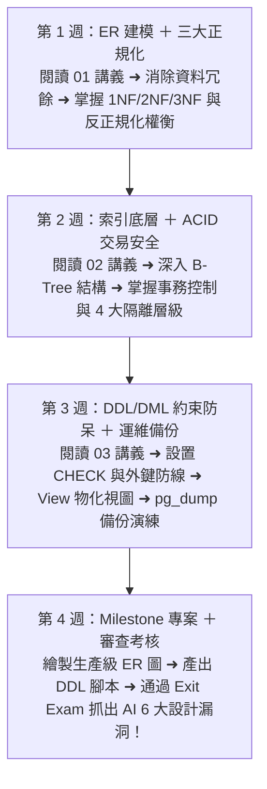

# Month 03｜資料庫設計與建模：不只會查資料，更懂如何設計架構

> **本月核心目標**：從單純寫 SQL 查詢進階為「架構設計師思維」，掌握實體關聯圖 (ER Diagram)、資料庫三大正規化 (1NF/2NF/3NF)、ACID 交易安全機制，並親手設計一套生產級 B2B 資料庫架構。

---

## 🗺️ Month 03 四步架構師修煉旅程（Roadmap）

---

## 📂 本模組教材文件導航

| 序號 | 篇章名稱 | 核心目標與學習內容 | 推薦時機 |
| :---: | :--- | :--- | :---: |
| **00** | [00_本月學習計畫與目標.md](./00_本月學習計畫與目標.md) | 📅 **4 週 28 天每日學習排程**、Git Commit 規範與驗收標準 | 開學第一天必讀 |
| **01** | [01_關聯式資料庫設計規範與正規化.md](./01_關聯式資料庫設計規範與正規化.md) | 實體辨識、正規化三步驟實例、多對多中介表、反正規化 (Denormalization) 的時機與權衡 | 第 1 週 |
| **02** | [02_Index索引原理與ACID交易機制.md](./02_Index索引原理與ACID交易機制.md) | B-Tree 索引結構、死鎖 (Deadlock)、隔離級別 (Isolation Levels)、金流/庫存扣減交易範例 | 第 2 週 |
| **03** | [03_PostgreSQL_DDL_DML與管理實務.md](./03_PostgreSQL_DDL_DML與管理實務.md) | `ALTER TABLE`, `CHECK Constraint`, `CASCADE` 串聯刪除/更新、備份還原實務 | 第 3 週 |
| **04** | [04_Exit_Exam_Schema_Review_Challenge.md](./04_Exit_Exam_Schema_Review_Challenge.md) | 🎓 **本月結業測驗**：審查 AI 設計的「毒瘤」Schema，抓出 6 大地雷、重構 3NF DDL 並執行 Constraint 破壞性測試 | 第 4 週 |
| **專案** | [Milestone_B2B關聯式資料庫設計/](./Milestone_B2B關聯式資料庫設計/README.md) | 🏆 **生產級架構里程碑**：包含 Customers, Products, Orders, Order_Items, Salespeople, Invoices 的完整 Mermaid ER 圖與生產級 DDL 腳本 | 第 4 週 |

---

## 🎯 本月三層完成度標準 (Three-Tier Mastery)

- 🟢 **Level 1 — Survival (必做及格線)**：
  - [ ] 理解 Primary Key、Foreign Key、Unique Key 與 NULL 約束。
  - [ ] 能看懂 ER 圖並寫出簡單的 `CREATE TABLE` 與 `ALTER TABLE`。
  - [ ] 理解 Transaction 基本指令（`BEGIN`, `COMMIT`, `ROLLBACK`）。
- 🔵 **Level 2 — Job Ready (標準求職線，80分晉級)**：
  - [ ] 掌握 1NF / 2NF / 3NF 正規化原則，能獨立設計一對多與多對多中介表。
  - [ ] 掌握 `CHECK Constraint` 與 `NUMERIC` 精度防呆，避免髒資料入庫。
  - [ ] 完成 **Milestone: B2B 關聯式資料庫架構設計**。
  - [ ] 通過 **[04_Exit_Exam_Schema_Review_Challenge.md](./04_Exit_Exam_Schema_Review_Challenge.md)**（抓出 AI 6 大設計漏洞並重構）。
- 🔴 **Level 3 — Bonus (面試溢價線)**：
  - [ ] 掌握 View vs Materialized View 定期刷新 Trade-off。
  - [ ] 深入理解 ACID 中 Isolation Level（4大隔離層級）與死鎖 (Deadlock) 排錯。
  - [ ] 掌握 `pg_dump` 備份與還原災難復原實務。
