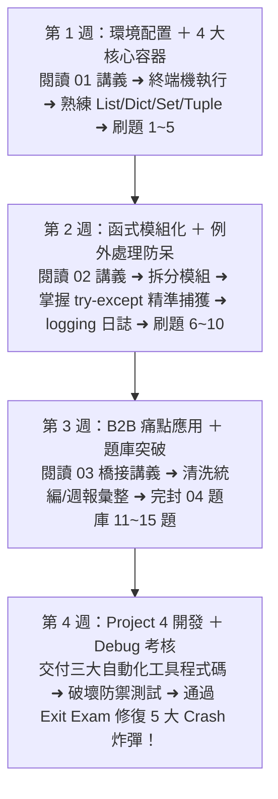

# Month 04｜Python 基礎與自動化小工具：具備寫程式解決問題的能力

> **本月核心目標**：建立扎實的 Python 程式邏輯底層（變數、容器、迴圈、函式、例外處理），並動手寫出 3 款能夠解決辦公室真實痛點的自動化小工具（Excel 整理、重複比對、檔案批次命名）。

---

## 🗺️ Month 04 四步程式自動化修煉旅程（Roadmap）

---

## 📂 本模組教材與工具程式碼導航

| 序號 | 篇章名稱 | 核心目標與學習內容 | 推薦時機 |
| :---: | :--- | :--- | :---: |
| **00** | [00_本月學習計畫與目標.md](./00_本月學習計畫與目標.md) | 📅 **4 週 28 天每日學習排程**、Git Commit 規範與驗收標準 | 開學第一天必讀 |
| **01** | [01_Python環境_語法_資料結構全攻略.md](./01_Python環境_語法_資料結構全攻略.md) | 環境配置、基礎型態、切片、字典索引與常用內建方法 | 第 1 週 |
| **02** | [02_函式_模組與例外處理除錯實務.md](./02_函式_模組與例外處理除錯實務.md) | 模組化設計、自訂例外、30 分鐘除錯心法與日誌基礎 | 第 2 週 |
| **03** | [03_B2B工作情境Python應用.md](./03_B2B工作情境Python應用.md) | **M4 → M5 橋接篇**：用 B2B 真實場景把語法轉化成實際自動化工具 | 第 3 週 |
| **04** | [04_Python語法練習題庫.md](./04_Python語法練習題庫.md) | 15 道精選基礎與商業演算法練習題（含詳細解法） | 第 1~3 週 |
| **05** | [05_Exit_Exam_Python除錯與防呆實戰.md](./05_Exit_Exam_Python除錯與防呆實戰.md) | 🎓 **本月結業測驗**：Python Debug Lab 實戰，修復 5 大崩潰炸彈，實作隔離區與單元測試 | 第 4 週 |
| **專案** | [Project_04_B2B三大自動化工具/](./Project_04_B2B三大自動化工具/) | 🏆 **自動化小工具原始碼**：報表整理器、重複名單偵測器、檔案批次更名器 | 第 4 週 |

---

## 🎯 本月三層完成度標準 (Three-Tier Mastery)

- 🟢 **Level 1 — Survival (必做及格線)**：
  - [ ] 成功安裝 Python 3.11+ 與 VS Code，能在終端機執行 `.py` 腳本。
  - [ ] 熟練基本資料型態與 4 大容器：`list`, `dict`, `tuple`, `set`。
  - [ ] 能看懂基本報錯 Traceback，定位發生錯誤的行數。
- 🔵 **Level 2 — Job Ready (標準求職線，80分晉級)**：
  - [ ] 掌握函式模組化、預設參數、檔案讀寫 (`with open`) 與 JSON 處理。
  - [ ] 掌握防禦性編程：`.get()` 預設值、`try...except` 精確捕獲特定異常。
  - [ ] 獨立完成 3 款可執行的 B2B 自動化小工具（整理/去重/批次命名）。
  - [ ] 通過 **[05_Exit_Exam_Python除錯與防呆實戰.md](./05_Exit_Exam_Python除錯與防呆實戰.md)**（修復 5 大 Crash 地雷並寫出單元測試）。
- 🔴 **Level 3 — Bonus (面試溢價線)**：
  - [ ] 掌握列表推導式與字典推導式的高效記憶體寫法。
  - [ ] 理解 Python EAFP 設計哲學與自定義 Exception 類別。
