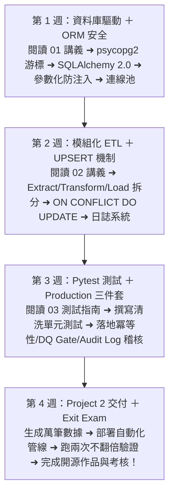

# Month 05｜Python × 資料庫整合與自動化 ETL 管線

> **本月核心目標**：打通 Python 與 PostgreSQL 的雙向傳輸，掌握現代 ORM (SQLAlchemy) 與底層驅動 (psycopg2)，打造一套自動讀取 Excel、資料驗證清洗、寫入資料庫並產出日誌與警報的 **端到端自動化 ETL 管線專案 (Project 2)**。

---

## 🗺️ Month 05 四步管線工程師修煉旅程（Roadmap）

---

## 📂 本模組教材與專案導航

| 序號 | 篇章名稱 | 核心目標與學習內容 | 推薦時機 |
| :---: | :--- | :--- | :---: |
| **00** | [00_本月學習計畫與目標.md](./00_本月學習計畫與目標.md) | 📅 **4 週 28 天每日學習排程**、Git Commit 規範與驗收標準 | 開學第一天必讀 |
| **01** | [01_SQLAlchemy與psycopg2實務.md](./01_SQLAlchemy與psycopg2實務.md) | 連線設定、參數綁定、ORM 映射與批次寫入效能對比 | 第 1 週 |
| **02** | [02_ETL自動化管線與日誌系統設計.md](./02_ETL自動化管線與日誌系統設計.md) | 資料清洗過濾器、重複鍵防呆處理 (UPSERT)、日誌輸出與錯誤告警 | 第 2 週 |
| **03** | [03_ETL_Testing指南.md](./03_ETL_Testing指南.md) | Pytest 單元測試框架、資料清洗邏輯測試與驗證規則自動化測試 | 第 3 週 |
| **04** | [04_Production工程三件套_冪等性_品質檢查與稽核日誌.md](./04_Production工程三件套_冪等性_品質檢查與稽核日誌.md) | 🛡️ **本月結業測驗 (Exit Exam)**：驗證冪等性 (Idempotency)、Data Quality Gate 攔截異常與 Audit Log 執行日誌 | 第 3~4 週 |
| **專案** | [Project_02_Excel至PostgreSQL自動化ETL管線/](./Project_02_Excel至PostgreSQL自動化ETL管線/README.md) | 🏆 **第二個開源作品**：完整的 Python ETL 程式碼、設定檔、模擬 Excel 生成腳本與 GitHub README | 第 4 週 |

---

## 🎯 本月三層完成度標準 (Three-Tier Mastery)

- 🟢 **Level 1 — Survival (必做及格線)**：
  - [ ] 能使用 psycopg2 / SQLAlchemy 成功連線本地 PostgreSQL 並執行 SELECT。
  - [ ] 掌握基礎 ETL 流程：從 Excel 讀取資料並寫入資料庫。
  - [ ] 掌握 `.env` 環境變數讀取與敏感資訊隔離。
- 🔵 **Level 2 — Job Ready (標準求職線，80分晉級)**：
  - [ ] 掌握 SQLAlchemy 2.0 參數化綁定（徹底防禦 SQL Injection）。
  - [ ] 實作 **Production 三件套**：冪等性（跑兩次資料不翻倍）+ Data Quality 檢查 + 稽核日誌。
  - [ ] 使用 Pytest 撰寫資料清洗與驗證規則的自動化單元測試。
  - [ ] 完成 **Project 2：Excel 至 PostgreSQL 自動化 ETL 管線專案**。
  - [ ] 通過 **[04_Production工程三件套_冪等性_品質檢查與稽核日誌.md](./04_Production工程三件套_冪等性_品質檢查與稽核日誌.md)** Exit 驗證。
- 🔴 **Level 3 — Bonus (面試溢價線)**：
  - [ ] 掌握連線池 (Connection Pool) 參數調優（`pool_size`, `max_overflow`）。
  - [ ] 實作資料庫交易控制 (`session.commit()`, `session.rollback()`) 與異常自動回滾。
