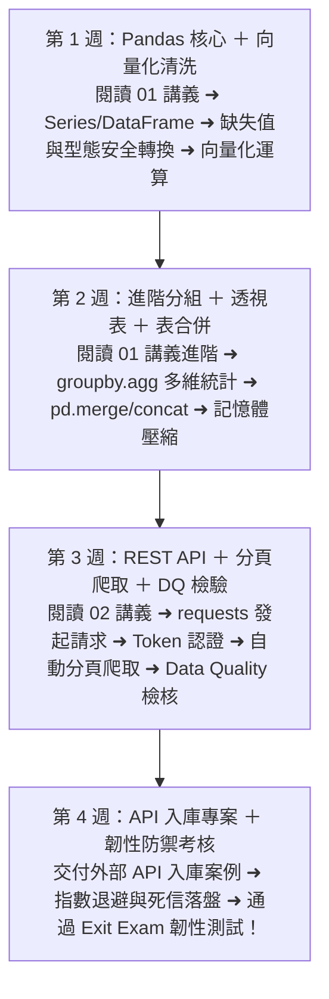

# Month 06｜Pandas 與 REST API：處理真實世界的外部資料

> **本月核心目標**：掌握現代資料處理主流函式庫 Pandas，並學會使用 Python `requests` 串接外部 REST API（如政府公開資料、匯率、氣象或企業 SaaS API），完成「外部 API ➜ 資料清理轉換 ➜ PostgreSQL 儲存 ➜ 分析視覺化」完整流程。

---

## 🗺️ Month 06 四步資料工程師修煉旅程（Roadmap）

---

## 📂 本模組教材與專案導航

| 序號 | 篇章名稱 | 核心目標與學習內容 | 推薦時機 |
| :---: | :--- | :--- | :---: |
| **00** | [00_本月學習計畫與目標.md](./00_本月學習計畫與目標.md) | 📅 **4 週 28 天每日學習排程**、Git Commit 規範與驗收標準 | 開學第一天必讀 |
| **01** | [01_Pandas數據清理與轉換完全手冊.md](./01_Pandas數據清理與轉換完全手冊.md) | DataFrame 必背操作、向量化運算 (Vectorization) 與效能最佳化 | 第 1~2 週 |
| **02** | [02_REST_API原理與Python_Requests.md](./02_REST_API原理與Python_Requests.md) | HTTP 核心概念、Requests 實戰、處理分頁 (Pagination) 與 Rate Limit 限制 | 第 3 週 |
| **03** | [03_Data_Quality模組指南.md](./03_Data_Quality模組指南.md) | Pandas 資料驗證、Schema 檢核與異常值偵測工具封裝 | 第 3 週 |
| **04** | [04_Exit_Exam_API_Failure_Lab.md](./04_Exit_Exam_API_Failure_Lab.md) | 🎓 **本月結業測驗**：API Failure & Resilience 實戰，防禦 429 限流、500 報錯、Timeout 超時與髒資料死信落盤 | 第 4 週 |
| **專案** | [Case_外部API資料擷取與分析存儲/](./Case_外部API資料擷取與分析存儲/README.md) | 🏆 **外部 API 入庫案例**：端到端 API 資料擷取、清洗轉換並寫入 PostgreSQL 的可執行專案代碼 | 第 4 週 |

---

## 🎯 本月三層完成度標準 (Three-Tier Mastery)

- 🟢 **Level 1 — Survival (必做及格線)**：
  - [ ] 熟練 Pandas 核心：`DataFrame` 建立、欄位選取、過濾與 `read_csv` / `to_csv`。
  - [ ] 理解 REST API 概念，能使用 `requests.get()` 取得 JSON 資料。
  - [ ] 理解常見 HTTP 狀態碼：200、400、404、500。
- 🔵 **Level 2 — Job Ready (標準求職線，80分晉級)**：
  - [ ] 熟練缺失值處理 (`fillna`, `dropna`)、型態轉換 (`to_datetime`, `to_numeric`) 與 `groupby().agg()`。
  - [ ] 掌握 API 分頁爬取 (Pagination) 與 Rate Limit 限制處理。
  - [ ] 完成 **外部 API 資料擷取與分析存儲案例**。
  - [ ] 通過 **[04_Exit_Exam_API_Failure_Lab.md](./04_Exit_Exam_API_Failure_Lab.md)**（實作具備指數退避、Jitter、Timeout 與死信落盤的高韌性請求器）。
- 🔴 **Level 3 — Bonus (面試溢價線)**：
  - [ ] 掌握 Pandas 向量化運算 (Vectorization)，杜絕低效的 `iterrows()` 迴圈。
  - [ ] 巨量資料分塊讀取 (`chunksize`) 與記憶體型態壓縮 (`category`, `int32`)。
