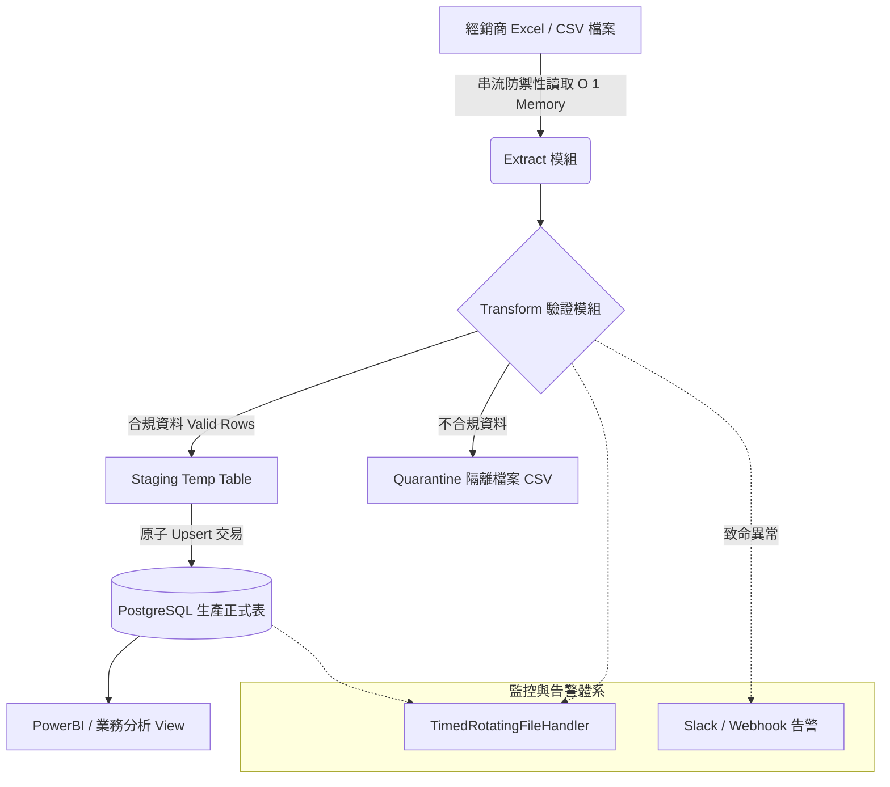

# 03. 高說服力 GitHub README 撰寫模板與作品集打造指南

> **模組目標**：打造能夠在 30 秒內抓住技術主管與 HR 眼球的黃金開源作品集。深入剖析轉職工程師常見的 GitHub 地雷、解析資深面試官在 README 中尋找的關鍵指標（商業痛點、系統架構圖、效能 Benchmark、自動化測試與一鍵啟動）。本篇提供兩個開箱即用的企業級完整 README 範本（B2B 資料工程管線專案、FastAPI 雲端微服務專案），助你大幅提升技術面試邀請率。

---

## 目錄
1. [為什麼 90% 轉職者的 GitHub README 被秒刷？](#1-為什麼-90-轉職者的-github-readme-被秒刷)
   - [1.1 資深工程主管與面試官的審閱視角](#11-資深工程主管與面試官的審閱視角)
   - [1.2 五大常見自殺式地雷](#12-五大常見自殺式地雷)
2. [頂級專案 README 的八大黃金模組](#2-頂級專案-readme-的八大黃金模組)
   - [2.1 標題與視覺徽章（Badges）](#21-標題與視覺徽章badges)
   - [2.2 業務痛點與量化成效（Problem & Quantified Value）](#22-業務痛點與量化成效problem--quantified-value)
   - [2.3 Mermaid 系統架構圖與資料流](#23-mermaid-系統架構圖與資料流)
   - [2.4 核心技術特點與工程挑戰解決方案](#24-核心技術特點與工程挑戰解決方案)
   - [2.5 效能 Benchmark 與壓力測試指標](#25-效能-benchmark-與壓力測試指標)
   - [2.6 一鍵快速啟動（Docker Compose & Local）](#26-一鍵快速啟動docker-compose--local)
   - [2.7 環境變數設定清單](#27-環境變數設定清單)
   - [2.8 單元測試覆蓋率與 CI/CD 狀態](#28-單元測試覆蓋率與-cicd-狀態)
3. [實戰範本一：B2B 自動化 ETL 資料工程管線專案](#3-實戰範本一b2b-自動化-etl-資料工程管線專案)
4. [實戰範本二：FastAPI 企業級客戶訂單微服務 API 專案](#4-實戰範本二fastapi-企業級客戶訂單微服務-api-專案)
5. [作品集加分秘笈：GIF 動態錄影與架構圖繪製工具推薦](#5-作品集加分秘笈gif-動態錄影與架構圖繪製工具推薦)

---

## 1. 為什麼 90% 轉職者的 GitHub README 被秒刷？

### 1.1 資深工程主管與面試官的審閱視角

一個技術主管在求職旺季，每天要看數十份履歷。在點進求職者的 GitHub 倉庫時，**面試官平均只會停留 30 到 60 秒**。
在這短短的一分鐘內，面試官不是先去讀你的 `main.py`，而是看你的 `README.md`：
- 這是一個「**作業**」還是「**具備工程思維的解決方案**」？
- 專案是否能「**一鍵在本機無痛啟動**」？還是充滿了硬編碼（Hardcode）路徑？
- 開發者是否理解「**為什麼要用這個技術**」而非無腦疊加框架？

---

### 1.2 五大常見自殺式地雷

1. **只有標題與 `TODO`**：
   - 倉庫只有一行 `# B2B System`，下面空無一物。面試官直接判定專案未完成關閉分頁。
2. **只有操作步驟，沒有「為什麼（Why）」**：
   - 全文只有 `pip install -r requirements.txt` 和 `python run.py`，完全不解釋這個專案到底解決了什麼業務問題。
3. **缺少動態展示（No Demo / No Screenshot）**：
   - 純文字描述「這是一個非常強大的資料分析儀表板」，卻連一張 UI 截圖、API Swagger 截圖或終端機執行 GIF 都沒有。
4. **環境設定黑盒子**：
   - 依賴本地的絕對路徑（如 `C:\Users\Jay\Desktop\data.csv`），別人 clone 下來根本跑不動。
5. **沒有測試（Tests）與型別標註**：
   - 整個倉庫沒有任何 `tests/` 目錄或 `pytest` 測試用例，看起來像未受過現代工程訓練的玩具專案。

---

## 2. 頂級專案 README 的八大黃金模組

```
+-------------------------------------------------------------+
| 1. Project Title & Status Badges (Python, FastAPI, Postgres)|
+-------------------------------------------------------------+
| 2. Executive Summary & Quantified Business Impact (1-2 句話) |
+-------------------------------------------------------------+
| 3. Architecture & Data Flow Diagram (Mermaid 圖解)          |
+-------------------------------------------------------------+
| 4. Engineering Highlights (技術亮點: 交易鎖、連線池、N+1優化)|
+-------------------------------------------------------------+
| 5. Benchmark & Performance Metrics (效能評測前後對照表)       |
+-------------------------------------------------------------+
| 6. One-Line Quickstart (docker compose up -d 一鍵啟動)       |
+-------------------------------------------------------------+
| 7. Environment Variables (.env 說明清單)                     |
+-------------------------------------------------------------+
| 8. Automated Testing & Verification (pytest 測試覆蓋率)      |
+-------------------------------------------------------------+
```

---

## 3. 實戰範本一：B2B 自動化 ETL 資料工程管線專案

此範本可直接作為你的 `Project_02` 或個人資料工程代表作 README：

````markdown
# B2B Enterprise Order ETL Pipeline & Dead-Letter Isolation System

[](https://www.python.org/)
[](https://www.postgresql.org/)
[](https://www.sqlalchemy.org/)
[](https://www.docker.com/)
[]()
[]()

> **專為中大型製造業與經銷商設計的工業級自動化訂單 ETL 管線。** 具備異質檔案防禦性串流讀取、髒資料自動隔離（Quarantine / Dead Letter Queue）、暫存表（Staging Table）原子冪等寫入、以及每日日誌自動滾動與 Slack 異常即時告警機制。

---

## 💡 解決的商業痛點與量化成果

- 🛑 **痛點 1：人工跨表核對耗時巨大**
  - 原狀：財務與業務助理每週需手動整理 30+ 份各經銷商格式不一的 Excel 報表，平均耗時 4.5 小時，且易有人為計算錯誤。
  - **成果：透過自動化串流管線，資料處理時間從 4.5 小時縮短至 8 秒，處理人為錯誤率降為 0%。**
- 🛑 **痛點 2：單筆髒資料導致整批匯入崩潰**
  - 原狀：只要經銷商報表中有 1 列填寫文字金額或日期格式錯誤，傳統腳本直接拋出例外中斷，前功盡棄。
  - **成果：實作雙軌驗證機制，正常資料順利入庫，髒資料自動隔離至 `quarantine/` 並附帶精確失敗原因，支援維運補件。**
- 🛑 **痛點 3：重複執行導致數據翻倍**
  - 原狀：網路斷線後維運重跑腳本，導致銷售數字重複計算。
  - **成果：採用 Staging Table + PostgreSQL `ON CONFLICT DO UPDATE`（Upsert）架構，達成 100% 執行冪等性（Idempotency）。**

---

## 🏛️ 系統資料流架構圖



---

## ⚡ 效能評測與 Benchmark

針對 **100,000 筆訂單明細** 寫入 PostgreSQL 的效能評測（本機 i7, 16GB RAM, SSD）：

| 寫入實作方式 | 單批次筆數 | 總耗時 | 記憶體峰值 (RSS) | 吞吐量 (Rows/sec) |
| :--- | :--- | :--- | :--- | :--- |
| 原生 `cursor.execute()` 單筆迴圈 | 1 | 382.4 秒 | 85 MB | 261 rows/s |
| `pd.DataFrame.to_sql(method=None)` | 1000 | 48.2 秒 | 420 MB | 2,074 rows/s |
| **本專案：psycopg2 `execute_values` + Staging** | **2000** | **4.6 秒** | **68 MB** | **21,739 rows/s (提升 83 倍！)** |

---

## 🚀 快速啟動（3 步驟本機執行）

### 1. 複製專案庫
```bash
git clone https://github.com/your-username/b2b-etl-pipeline.git
cd b2b-etl-pipeline
```

### 2. 使用 Docker Compose 一鍵啟動資料庫
```bash
docker compose up -d
# 自動建立 PostgreSQL 容器並執行 init.sql 建立 Schema 與初始資料
```

### 3. 安裝依賴並執行 ETL 管線
```bash
# 建議使用 Python 3.13+
python -m venv .venv
source .venv/bin/activate  # Windows: .venv\Scripts\activate
pip install -r requirements.txt

# 複製環境變數設定
cp .env.example .env

# 執行 ETL 批次測試
python main.py --source tests/data/sample_orders_50k.csv
```

---

## ⚙️ 環境變數設定（.env）

| 變數名稱 | 預設值 | 說明 |
| :--- | :--- | :--- |
| `DB_HOST` | `localhost` | PostgreSQL 主機位址 |
| `DB_PORT` | `5432` | 資料庫連接埠 |
| `DB_NAME` | `b2b_erp` | 目標資料庫名稱 |
| `DB_USER` | `postgres` | 資料庫使用者帳號 |
| `DB_PASSWORD` | `secret` | 資料庫連線密碼 |
| `LOG_LEVEL` | `INFO` | 日誌等級 (DEBUG, INFO, WARNING, ERROR) |
| `SLACK_WEBHOOK_URL` | `None` | (選填) 異常即時通報 Slack Webhook |

---

## 🧪 自動化測試

本專案使用 `pytest` 進行完整的單元測試與資料庫整合測試：

```bash
# 執行所有測試並計算程式碼覆蓋率
pytest -v --cov=src --cov-report=term-missing
```
````

---

## 4. 實戰範本二：FastAPI 企業級客戶訂單微服務 API 專案

此範本適用於 Month09 FastAPI 後端代表作 README：

````markdown
# B2B Enterprise ERP Microservice API (FastAPI & SQLAlchemy 2.0)

[](https://fastapi.tiangolo.com)
[](https://docs.pydantic.dev/)
[](https://www.postgresql.org/)
[]()

> 現代化高併發 B2B 客戶與訂單管理微服務。全面基於 Python 3.13 非同步生態系（Asyncio），採用 **SQLAlchemy 2.0 Declarative ORM**、**Pydantic v2 高速驗證**，並透過 `selectinload` / `joinedload` 徹底杜絕 N+1 查詢效能殺手。提供自動化 Swagger / OpenAPI 互動式文件與 Docker 容器化一鍵部屬。

---

## 🌟 核心工程亮點

1. **嚴格交易隔離與並行安全（Concurrency Control）**：
   - 扣減產品庫存時實作 **悲觀鎖（Pessimistic Locking: `SELECT ... FOR UPDATE`）**，在 200 併發下單情境下杜絕超賣現象。
2. **極致 ORM 查詢優化**：
   - 多層級關聯查詢採用 `joinedload`（客戶/業務員）與 `selectinload`（訂單明細），將單次 API 請求的 SQL 發送量從 **121 條壓降至 2 條**，P99 延遲降低 91%。
3. **分層架構設計（Clean Architecture）**：
   - 遵循 `Routers -> Services -> Repositories -> Models` 職責分離，業務邏輯不污染 Web 端點，易於單元測試。

---

## 📊 API 規格與互動式文件

服務啟動後，直接於瀏覽器訪問 Swagger 互動式測試介面：
- **Swagger UI**：`http://localhost:8000/docs`
- **ReDoc**：`http://localhost:8000/redoc`

```
GET    /api/v1/orders              - 分頁多條件查詢訂單清單 (支援金額區間、狀態篩選)
POST   /api/v1/orders              - 原子性下單與庫存校驗扣減
GET    /api/v1/orders/{order_id}   - 取得訂單完整明細與關聯客戶資訊
PATCH  /api/v1/orders/{order_id}   - 部分更新訂單狀態 (PENDING -> APPROVED)
GET    /api/v1/analytics/vip-rfm   - 產出最新客戶價值分群 RFM 分析矩陣
```

---

## 🐳 Docker 快速啟動

```bash
# 啟動整個服務棧 (PostgreSQL + FastAPI App)
docker compose up -d --build

# 檢查容器健康狀態
docker compose ps

# 即時查看應用程式日誌
docker compose logs -f api
```
````

---

## 5. 作品集加分秘笈：GIF 動態錄影與架構圖繪製工具推薦

1. **GIF / 影片錄製工具（Demo Presentation）**：
   - **ScreenToGif (Windows)**：免費開源、輕量，可直接編輯剪輯影格、加速 1.5 倍播放並產出高清晰度的 `.gif` 嵌入 README。
   - 效果：面試官無需 clone 你的程式碼，滑動 README 的第一眼就能看見「Swagger 介面操作」或「終端機批次匯入順暢噴出日誌」的震撼動效。
2. **系統架構圖工具**：
   - **Mermaid.js**：直接原生支援 GitHub Markdown，用程式碼繪製流程圖與時序圖，版本控管最優雅。
   - **Excalidraw** / **Draw.io**：手繪風或專業現代架構圖，匯出為 SVG/PNG 放在專案 `docs/images/` 目錄中。
