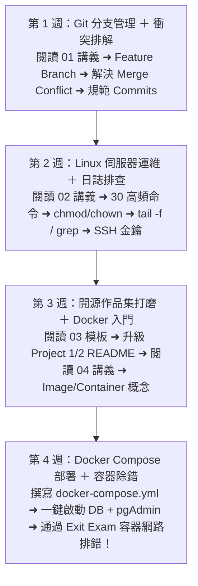

# Month 07｜工程素養：Git 版本控制、Linux 伺服器與專業開源習慣

> **本月核心目標**：告別把代碼只塞在本機電腦或隨身碟的業餘習慣，像真正的軟體工程師一樣使用 Git 分支管理、Linux 命令列排錯，並打造專業高質感的 GitHub 個人作品集主頁。

---

## 🗺️ Month 07 四步工程素養修煉旅程（Roadmap）

---

## 📂 本模組教材文件導航

| 序號 | 篇章名稱 | 核心目標與學習內容 | 推薦時機 |
| :---: | :--- | :--- | :---: |
| **00** | [00_本月學習計畫與目標.md](./00_本月學習計畫與目標.md) | 📅 **4 週 28 天每日學習排程**、Git Commit 規範與驗收標準 | 開學第一天必讀 |
| **01** | [01_工程師必備Git與GitHub工作流.md](./01_工程師必備Git與GitHub工作流.md) | Git 衝突 (Conflict) 解決、Feature Branch 規範與 Conventional Commits | 第 1 週 |
| **02** | [02_Linux常用指令與伺服器操作.md](./02_Linux常用指令與伺服器操作.md) | 伺服器部署必備 30 個高頻指令、進程排查與日誌監控 (`tail -f`) | 第 2 週 |
| **03** | [03_高說服力GitHub_README撰寫模板.md](./03_高說服力GitHub_README撰寫模板.md) | 面試官最想看的 README 結構：架構圖、痛點對比、快速啟動指令與技術亮點 | 第 3 週 |
| **04** | [04_Docker入門_本機開發環境建置.md](./04_Docker入門_本機開發環境建置.md) | Image / Container / Volume 核心概念、撰寫 Dockerfile、**一鍵啟動 PostgreSQL + PgAdmin 開發環境** | 第 3~4 週 |
| **05** | [05_Exit_Exam_Docker網路與容器除錯Lab.md](./05_Exit_Exam_Docker網路與容器除錯Lab.md) | 🎓 **本月結業測驗**：Docker Failure Lab 容器網路排錯實戰，破解 Container 內的 localhost 世紀難題與健康檢查 | 第 4 週 |

---

## 🎯 本月三層完成度標準 (Three-Tier Mastery)

- 🟢 **Level 1 — Survival (必做及格線)**：
  - [ ] 掌握 Git 核心三區域與基本指令（`add`, `commit`, `push`, `pull`）。
  - [ ] 掌握標準 `.gitignore` 撰寫，嚴禁 `.env` 與金鑰誤上傳 GitHub。
  - [ ] 掌握 Linux 必備指令：`cd`, `ls`, `cat`, `grep`, `tail -f`。
  - [ ] 能使用 `docker compose up -d` 啟動現成的 PostgreSQL 環境。
- 🔵 **Level 2 — Job Ready (標準求職線，80分晉級)**：
  - [ ] 掌握 Git 分支管理 (`git checkout -b`, `git merge`) 與解決代碼衝突。
  - [ ] 規範 Commit Message 格式（Conventional Commits: `feat:`, `fix:`, `docs:`）。
  - [ ] 獨立撰寫包含 Volume 資料持久化與環境變數綁定的 `docker-compose.yml`。
  - [ ] 通過 **[05_Exit_Exam_Docker網路與容器除錯Lab.md](./05_Exit_Exam_Docker網路與容器除錯Lab.md)**（排查 localhost 網路陷阱與健康檢查）。
- 🔴 **Level 3 — Bonus (面試溢價線)**：
  - [ ] 深入理解 Linux Namespaces 與 Cgroups 底層隔離技術。
  - [ ] 掌握 SSH 金鑰授權、Linux 檔案權限 (`chmod`, `chown`) 與進程排查 (`ps aux`, `top`)。
