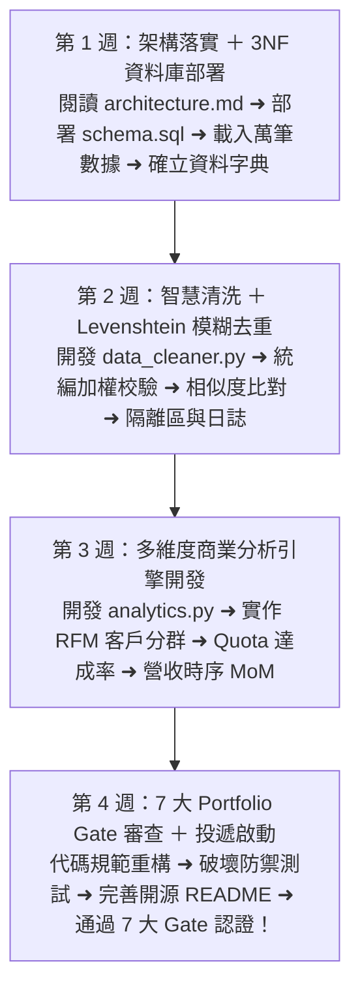
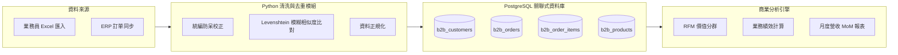

# 🚀 B2B Customer Data System（企業級客戶數據與業務分析系統）

> **這是一份專為轉職 IT / 資料工程 / 後端工程師打磨的旗艦主力作品。**
> 整合了 B2B 商業實務、PostgreSQL 3NF 資料庫設計、Python 自動化清洗去重演算法與多維度業務分析引擎。

---

## 🗺️ Month 08 四步旗艦作品交付旅程（Roadmap）



| 檔案導航 | 說明 |
| :--- | :--- |
| 📅 **[00_本月學習計畫與目標.md](./00_本月學習計畫與目標.md)** | **4 週 28 天每日專案衝刺排程**、Git Commit 規範與驗收標準 |
| 🏆 **[00_Portfolio_Gate_求職通關7大審查標準.md](./00_Portfolio_Gate_求職通關7大審查標準.md)** | 面試官視角 7 大通關審查（通過後正式開啟履歷投遞） |
| 🏛️ **[architecture.md](./architecture.md)** | 系統四層架構設計文檔與資料流規範 |

---

## 📌 版本說明：兩階段交付策略

本旗艦作品分兩個版本交付，這樣在 M8 就能開始投履歷，不需要等 M11 完成 AI 功能：

```
v1.0 — 工程版（M8 完成，面試可展示）
  ✅ B2B PostgreSQL 完整 Schema（6 張表、3NF 正規化）
  ✅ Python 資料清洗 + 去重管線（Levenshtein 模糊比對）
  ✅ 多維度商業分析引擎（RFM、業務績效、MoM）
  ✅ FastAPI API 化（M9）
  ✅ Docker Compose 一鍵啟動（M10）
  → 可在 M8 末開始投 Data Analyst / Junior Data Engineer

v2.0 — AI 升級版（M11 完成，面試核武器）
  ✅ 上述 v1.0 全部功能 +
  ✅ AI Text-to-SQL 智慧查詢引擎
  ✅ 自然語言輸入 → SQL 生成 → 安全驗證 → 自然語言報告
  ✅ 多角色 Agent 架構（M11 教材）
  → 展示 AI 落地應用，差異化競爭力
```

> **面試策略**：M8 拿 v1.0 投工程職位，M11 升級到 v2.0 作為核武器。

---

## 🌟 v1.0 核心亮點（M8 完成）

- **嚴謹的企業級關聯架構**：以 3NF 正規化設計 6 大實體表（業務、客戶、產品、訂單、明細、發票），具備外鍵約束、Check 防呆與 B-Tree 索引最佳化。
- **智慧去重與清洗管線 (Data Hygiene)**：運用統編驗證與 Levenshtein / SequenceMatcher 模糊比對演算法，自動識別業務員重複建檔的可疑客戶。
- **全自動化商業分析引擎 (Analytics Engine)**：自動計算 RFM 客戶分群、業務員 Quota 達成率、產品毛利貢獻與月增率 (MoM)，並支援自動產出 CSV 報表。

---

## 🏛️ 系統架構與資料流（v1.0）



---

## 📁 模組結構與求職審查

- [00_Portfolio_Gate_求職通關7大審查標準.md](./00_Portfolio_Gate_求職通關7大審查標準.md)：🏆 **投遞前必讀**！包含架構手繪、白板 SQL、企業級 AI 安全防禦鏈、四大災難防禦問答與 3 分鐘 Demo 劇本。
- [architecture.md](./architecture.md)：詳細系統架構說明與 ER 關聯圖。
- [db/schema.sql](./db/schema.sql)：資料庫 DDL 建立腳本。
- [db/seed_mock_data.sql](./db/seed_mock_data.sql)：完整 B2B 測試數據。
- [src/data_cleaner.py](./src/data_cleaner.py)：客戶去重與資料清洗核心演算法。
- [src/analytics.py](./src/analytics.py)：商業數據多維度分析與報表產出模組。

---

## ⚡ 快速執行專案（v1.0）

```bash
# 方式 1：直接執行（需本機安裝 PostgreSQL）
pip install -r requirements.txt
python src/data_cleaner.py
python src/analytics.py

# 方式 2：Docker 一鍵啟動（M10 完成後）
docker-compose up -d
```

---

## 🎯 M8 月底成果 Checklist

```
□ docker-compose up 能成功啟動 PostgreSQL
□ schema.sql 執行後，6 張資料表建立完成
□ seed_mock_data.sql 匯入模擬資料（至少 100 筆客戶、500 筆訂單）
□ data_cleaner.py 能找出重複客戶並輸出報告
□ analytics.py 能產出 RFM 分群結果和業務績效排名
□ GitHub README 完整（架構說明 + ER Diagram + 執行方式）
□ 開始投履歷（Data Analyst / Junior Data Engineer / Automation Engineer）

等 M11 完成後，加入：
□ AI Text-to-SQL 查詢引擎整合
□ v2.0 Demo 錄製
□ README 更新為 v2.0
```
