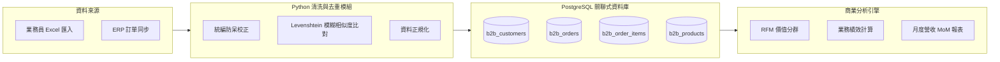

# 🚀 B2B Customer Data System (企業級客戶數據與業務分析系統)

> **這是一份專為轉職 IT / 資料工程 / 後端工程師打磨的旗艦主力作品。**
> 整合了 B2B 商業實務、PostgreSQL 3NF 資料庫設計、Python 自動化清洗去重演算法與多維度業務分析引擎。

---

## 🌟 專案核心亮點 (Core Highlights)

- **嚴謹的企業級關聯架構**：以 3NF 正規化設計 6 大實體表（業務、客戶、產品、訂單、明細、發票），具備外鍵約束、Check 防呆與 B-Tree 索引最佳化。
- **智慧去重與清洗管線 (Data Hygiene)**：運用統編驗證與 Levenshtein / SequenceMatcher 模糊比對演算法，自動識別業務員重複建檔的可疑客戶。
- **全自動化商業分析引擎 (Analytics Engine)**：自動計算 RFM 客戶分群、業務員 Quota 達成率、產品毛利貢獻與月增率 (MoM)，並支援自動產出 CSV 報表。

---

## 🏛️ 系統架構與資料流 (Architecture & Data Flow)



---

## 📁 模組結構

- [architecture.md](./architecture.md)：詳細系統架構說明與 ER 關聯圖。
- [db/schema.sql](./db/schema.sql)：資料庫 DDL 建立腳本。
- [db/seed_mock_data.sql](./db/seed_mock_data.sql)：完整 B2B 測試數據。
- [src/data_cleaner.py](./src/data_cleaner.py)：客戶去重與資料清洗核心演算法。
- [src/analytics.py](./src/analytics.py)：商業數據多維度分析與報表產出模組。

---

## ⚡ 快速執行專案

```bash
# 1. 安裝套件
pip install -r requirements.txt

# 2. 執行客戶去重檢測模組
python src/data_cleaner.py

# 3. 執行商業分析與營收報表產出
python src/analytics.py
```
