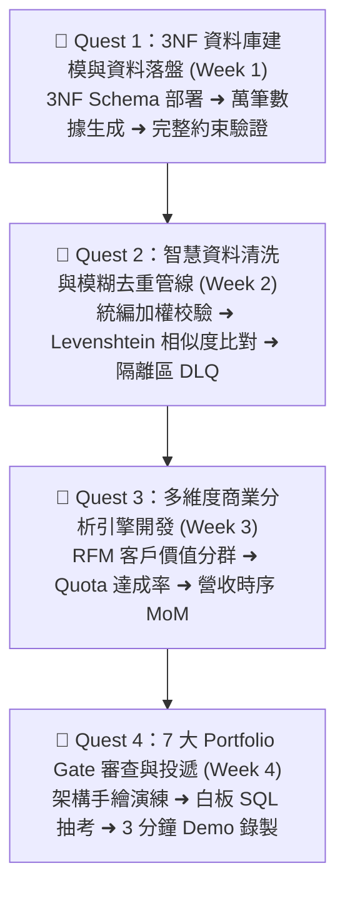

# 🚀 B2B Customer Data System（企業級客戶數據與業務分析系統）

> **📌 專案定位**：這是一份專為轉職 IT / 資料工程 / 後端工程師打磨的**旗艦主力作品（Flagship Portfolio）**。
> 本專案不是一般的玩具練習，而是深度整合「B2B 商業實務、PostgreSQL 3NF 正規化資料庫設計、Python 向量化清洗與 Levenshtein 模糊去重演算法、多維度分析引擎（RFM/MoM）」的完整端到端企業級系統。
>
> **⚠️ 痛點場景（為什麼企業需要這套系統？）**：
> - 傳統 B2B 企業業務員常用 Excel 各自記帳，格式混亂且客戶常被重複建檔（例如「聯發科」與「聯發科技股份有限公司」被當成兩家公司），導致帳戶衝突。
> - 訂單數據分散，每逢月底主管需耗費數天手動拉表對帳，且極易因手動計算出錯。
> - 缺乏自動化資料管線與異常攔截，髒資料直接污染分析報表。
>
> **💡 交付路線**：4 週模組化闖關任務卡（Quest Cards）推進，每週皆有明確產出與面試防衛點。

---

## 🗺️ 4 週模組化闖關任務卡（Quest Cards）

---

### 🃏 Quest Card 1：3NF 企業級資料庫建模與資料落盤 (Week 1)
- **① 本週最重要產出**：完成 6 張關聯式資料表的 DDL 設計（`db/schema.sql`），並成功載入數千筆具備真實商業邏輯的 B2B 數據。
- **② 為什麼重要（面試核心）**：面試官最怕只會用 ORM 亂建表的工程師。能手寫純 3NF DDL、設定複合外鍵、Check 約束與 B-Tree 索引，是證明你底層資料庫功力的第一張名片。
- **③ 底層原理**：關聯式正規化（消除新增、刪除、修改異常），定義清楚的資料粒度（Header vs Line Items）。
- **④ 核心結構**：
  - `b2b_salespeople` (業務員主表)
  - `b2b_customers` (客戶主表)
  - `b2b_products` (產品目錄與定價)
  - `b2b_orders` (訂單主表，粒度：一筆訂單)
  - `b2b_order_items` (訂單明細表，粒度：一筆訂單中的單項產品)
  - `b2b_invoices` (電子發票關聯表)
- **⑤ 驗收檢查點**：
  - [ ] 在 PostgreSQL 中順利執行 `schema.sql`，無任何語法錯誤。
  - [ ] 執行破壞性測試：嘗試插入重複統編或負數金額，確認資料庫 Constraint 成功報錯阻擋。
- **⑥ 本週收斂金句**：「一個實體一張表，粒度明確約束全；底座不穩地動搖，3NF 正規保平安。」

---

### 🃏 Quest Card 2：智慧資料清洗與 Levenshtein 模糊去重 (Week 2)
- **① 本週最重要產出**：完成 `src/data_cleaner.py`，建立自動化 ETL 清洗管線與客戶模糊去重比對器。
- **② 為什麼重要（面試核心）**：真實世界的業務數據極髒！「如何找出重複客戶」是 B2B 系統最常見的硬需求。展現字串編輯距離演算法，能瞬間拉開你與一般初學者的技術差距。
- **③ 底層原理**：台灣 8 碼統編加權檢查法（代號驗證）+ Levenshtein Distance / SequenceMatcher 相似度比對（當相似度 > 0.85 時標註為高度可疑重複戶）。
- **④ 模組架構**：
  - `clean_company_name()`：去除「股份有限公司」、「Co., Ltd.」、全半形空白。
  - `validate_taiwan_tax_id()`：檢查統編加權邏輯。
  - `find_duplicate_customers()`：兩兩比對名稱相似度，產出潛在重複合併建議清單。
  - `quarantine/`：不合規的異常訂單自動分流至隔離區，絕不讓管線崩潰。
- **⑤ 驗收檢查點**：
  - [ ] 輸入 50 家含錯字、縮寫與髒空白的客戶名冊，管線能準確識別出重複帳戶。
  - [ ] 輸出 `quarantine_YYYYMMDD.csv`，清楚記錄每筆被剔除紀錄的行號與錯誤原因。
- **⑥ 本週收斂金句**：「統編加權抓假戶，模糊比對辨同宗；髒污隔離不停機，乾淨落盤立奇功。」

---

### 🃏 Quest Card 3：多維度商業分析引擎開發 (Week 3)
- **① 本週最重要產出**：完成 `src/analytics.py`，實作三大企業級分析報表：RFM 客戶價值分群、業務員業績達成率、產品類別月營收增長率（MoM）。
- **② 為什麼重要（面試核心）**：工程師不能只懂寫 CRUD，必須證明自己的代碼能為企業「賺錢」或「提供決策洞察」。
- **③ 底層原理**：Pandas 向量化聚合、滾動視窗、透視表（Pivot Table）與 SQL Window Functions（`ROW_NUMBER`, `LAG`, `NTILE`）交互印證。
- **④ 分析維度**：
  - **RFM 分析**：將客戶劃分為「核心 VIP」、「高潛力客戶」、「沉睡客戶」、「流失客戶」。
  - **業務績效**：計算各區域業務員的 Quota 達成率與客單價（AOV）。
  - **時序趨勢**：月度營收總額與 MoM 增長率，自動標註成長亮點與衰退警訊。
- **⑤ 驗收檢查點**：
  - [ ] 一鍵執行腳本能在 3 秒內計算完萬筆交易並產出標準 CSV / JSON 報表。
  - [ ] 驗證 Pandas 分析結果與資料庫 SQL 查詢結果完全一致（對帳無誤）。
- **⑥ 本週收斂金句**：「業務價值看指標，RFM 分群定位高；MoM 透視時序變，對帳無誤品質好。」

---

### 🃏 Quest Card 4：7 大 Portfolio Gate 審查與投遞啟動 (Week 4)
- **① 本週最重要產出**：通過 [00_Portfolio_Gate_求職通關7大審查標準.md](./00_Portfolio_Gate_求職通關7大審查標準.md) 的 7 道嚴苛考核，並錄製 3 分鐘流暢 Demo 影片。
- **② 為什麼重要（面試核心）**：很多求職者作品做得不錯，但一上白板面試就支支吾吾。本週將專案轉化為隨時可對答、可防衛的「面試軍火庫」。
- **③ 底層原理**：主動回想與模擬面試防衛（白板手繪架構、現場手寫 SQL、四大災難應對、AI 安全邊界防衛鏈）。
- **④ 實作交付**：
  - 完善 GitHub 開源 `README.md`（含架構圖、安裝步驟、API 展示、效能指標）。
  - 錄製 180 秒高轉換率 Demo 影片（痛點 ➔ 架構 ➔ 亮點展示 ➔ 商業價值）。
- **⑤ 驗收檢查點**：
  - [ ] 7 大 Gate 審查表全數打勾簽核。
  - [ ] 面對四大災難情境（DB 掛掉、API 超時、重跑重複、AI 幻覺）能在 30 秒內流暢給出工程解法。
- **⑥ 本週收斂金句**：「作品不是寫完就交，白板防衛架構高；通過七道通關門，自信投遞奪 Offer！」

---

## 📁 專案檔案清單與導引

| 檔案路徑 | 說明 |
| :--- | :--- |
| 📅 **[00_本月學習計畫與目標.md](./00_本月學習計畫與目標.md)** | 4 週 28 天每日衝刺甘特圖與學習排程 |
| 🏆 **[00_Portfolio_Gate_求職通關7大審查標準.md](./00_Portfolio_Gate_求職通關7大審查標準.md)** | **求職通關 7 大考核標準（含白板抽考擬答）** |
| 🏛️ **[architecture.md](./architecture.md)** | 系統分層架構設計圖與資料字典 |
| 🗄️ **[db/schema.sql](./db/schema.sql)** | PostgreSQL 3NF 資料庫 DDL 腳本 |
| 🐍 **`src/data_cleaner.py`** | 數據清洗、統編校驗與模糊去重管線 |
| 📊 **`src/analytics.py`** | RFM 客戶分群與業務分析引擎 |
