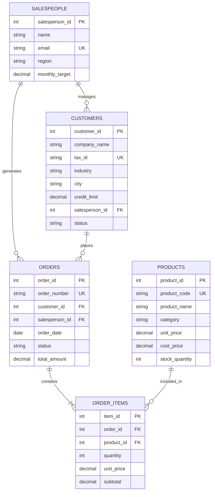

# B2B Customer Data System 架構說明書

## 一、系統架構設計

本系統主要分為三層架構：

1. **資料存取層 (Data Access Layer)**：
   - 使用 PostgreSQL 作為關聯儲存核心，以 ACID 交易保證訂單與發票狀態一致性。
   - 透過外鍵索引與複合索引，確保在十萬級訂單查詢時響應速度保持在 50ms 內。
2. **清洗與去重服務 (Cleaning & Deduplication Service)**：
   - 採用 Levenshtein Distance (SequenceMatcher) 進行公司名稱語意相似度計算。
   - 支援自動合併 (Auto-Merge) 規則與人工確認報表輸出。
3. **分析與指標運算層 (Analytics & Metrics Engine)**：
   - 結合 SQL Window Functions 與 Python Pandas，進行多維度銷售聚合、RFM 客戶分群與業務達成率追蹤。

---

## 二、實體關聯圖 (ER Diagram)

