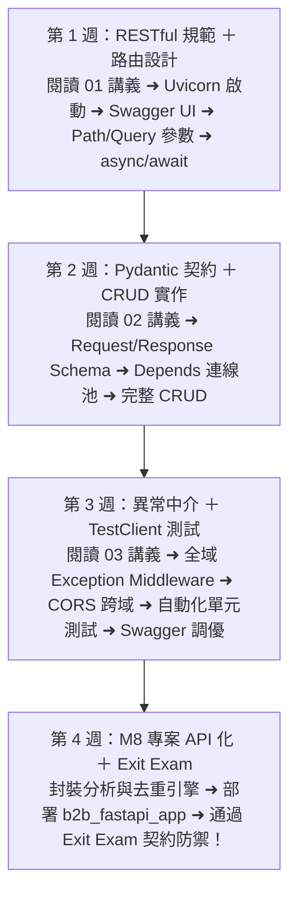

# Month 09｜後端開發：使用 FastAPI 將 B2B 系統 API 化

> **本月核心目標**：從單純的資料腳本跨入「現代 Web 後端服務」，使用 Python 當紅的高效能非同步框架 FastAPI，為 Month 8 的 B2B 客戶與訂單數據系統構建標準 RESTful API，並利用自動產生的 Swagger UI 進行互動式測試。

---

## 🗺️ Month 09 四步後端開發修煉旅程（Roadmap）

---

## 📂 本模組教材與應用程式導航

| 序號 | 篇章名稱 | 核心目標與學習內容 | 推薦時機 |
| :---: | :--- | :--- | :---: |
| **00** | [00_本月學習計畫與目標.md](./00_本月學習計畫與目標.md) | 📅 **4 週 28 天每日學習排程**、Git Commit 規範與驗收標準 | 開學第一天必讀 |
| **01** | [01_RESTful_API設計與FastAPI快速上手.md](./01_RESTful_API設計與FastAPI快速上手.md) | REST 原則、非同步 async/await 概念與路徑參數/查詢參數 | 第 1 週 |
| **02** | [02_Pydantic資料驗證與CRUD實作.md](./02_Pydantic資料驗證與CRUD實作.md) | BaseModel 宣告、Field 驗證規則、Schema 與 ORM 映射轉換 | 第 2 週 |
| **03** | [03_FastAPI_Testing與API文件品質.md](./03_FastAPI_Testing與API文件品質.md) | TestClient 單元測試、狀態碼斷言與 Swagger 互動文檔調優 | 第 3 週 |
| **04** | [04_Exit_Exam_API_Contract與型別防呆.md](./04_Exit_Exam_API_Contract與型別防呆.md) | 🎓 **本月結業測驗**：API Contract 規範實作、Pydantic V2 邊界型別防禦與自動化測試套件驗證 | 第 4 週 |
| **專案** | [b2b_fastapi_app/](./b2b_fastapi_app/) | 🏆 **生產級 API 程式碼庫**：含 `main.py`, `models.py`, `schemas.py`, `crud.py`, `database.py` | 第 4 週 |

---

## 🎯 本月三層完成度標準 (Three-Tier Mastery)

- 🟢 **Level 1 — Survival (必做及格線)**：
  - [ ] 能使用 FastAPI 啟動 Uvicorn 伺服器，造訪 `/docs` 成功測試「Hello World」。
  - [ ] 掌握基本 GET / POST 路由與 Path / Query 參數接收。
  - [ ] 掌握基礎 Pydantic BaseModel 型別定義。
- 🔵 **Level 2 — Job Ready (標準求職線，80分晉級)**：
  - [ ] 實作完整的客戶與訂單 CRUD 端點，結合 SQLAlchemy ORM 與資料庫持久化。
  - [ ] 掌握 FastAPI 依賴注入 (`Depends(get_db)`) 共享資料庫連線池。
  - [ ] 掌握 Pydantic 邊界防呆（正則統編、正數金額、Email 格式）。
  - [ ] 使用 `TestClient` 撰寫自動化測試，覆蓋正常與異常狀態碼。
  - [ ] 通過 **[04_Exit_Exam_API_Contract與型別防呆.md](./04_Exit_Exam_API_Contract與型別防呆.md)**。
- 🔴 **Level 3 — Bonus (面試溢價線)**：
  - [ ] 深刻理解 `async def` 與同步 `def` 的執行緒模型差異與 Event Loop 阻塞避坑。
  - [ ] 實作 JWT Token 認證或 API Key 授權中介軟體 (Middleware)。

---

## 🔗 章節導航與跨模組串聯

- **前一模組**：[Month 08 旗艦主力專案：B2B 客戶數據系統](../08_Month08_旗艦主力專案_B2B客戶數據系統/README.md)（四層分層架構、演算法去重與業務指標引擎）
- **下一模組**：[Month 10 容器化與雲端部署](../10_Month10_容器化與部署_Docker/README.md)（將 FastAPI 與 PostgreSQL 容器化並一鍵部署雲端）
- **回到總目錄**：[12 個月 IT 轉職實戰教材庫主導航](../README.md)

