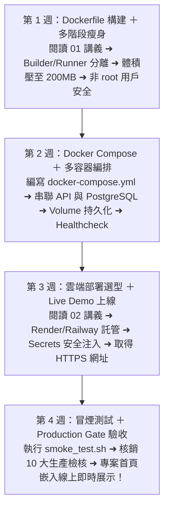

# Month 10｜容器化與雲端部署：讓所有人都能使用你的服務

> **本月核心目標**：擺脫「在我電腦上可以跑，在你電腦上會壞掉」的窘境。掌握 Docker 映像檔建置、Docker Compose 多容器編排（FastAPI + PostgreSQL + pgAdmin），並將作品一鍵部署至雲端平台（如 Render / Railway / AWS VPS），產出一個有即時線上網址的 Live Demo。

---

## 🗺️ Month 10 四步雲端部署修煉旅程（Roadmap）

---

## 📂 本模組教材與容器配置導航

| 序號 | 篇章名稱 | 核心目標與學習內容 | 推薦時機 |
| :---: | :--- | :--- | :---: |
| **00** | [00_本月學習計畫與目標.md](./00_本月學習計畫與目標.md) | 📅 **4 週 28 天每日學習排程**、Git Commit 規範與驗收標準 | 開學第一天必讀 |
| **01** | [01_Docker進階_多階段建置與容器安全.md](./01_Docker進階_多階段建置與容器安全.md) | Docker 核心深化、Multi-stage Build 映像檔瘦身、非 root 容器安全與網路隔離 | 第 1 週 |
| **02** | [02_雲端部署策略_PaaS與VPS選型實戰.md](./02_雲端部署策略_PaaS與VPS選型實戰.md) | PaaS（Render / Railway）vs 自建 VPS 選型矩陣、Nginx 反向代理、HTTPS 憑證 | 第 3 週 |
| **03** | [03_Production_Gate_生產部署檢核表.md](./03_Production_Gate_生產部署檢核表.md) | 🚀 **本月結業通關閘門 (Production Gate)**：10 大生產檢核清單、Secrets 審計與自動化冒煙測試 | 第 4 週 |
| **配置** | [Dockerfile](./Dockerfile) | FastAPI 生產環境輕量化多階段構建檔 | 第 1 週 |
| **編排** | [docker-compose.yml](./docker-compose.yml) | 一鍵啟動 FastAPI 後端 + PostgreSQL 16 + Adminer GUI 容器編排檔 | 第 2 週 |

> **📌 前置知識**：本月的 Docker 內容是 [M7/04_Docker入門_本機開發環境建置.md](../07_Month07_工程素養_Git與Linux/04_Docker入門_本機開發環境建置.md) 的進階延伸，請確認已完成 M7 的 Docker 入門章節。

---

## 🎯 本月三層完成度標準 (Three-Tier Mastery)

- 🟢 **Level 1 — Survival (必做及格線)**：
  - [ ] 理解 Image、Container 與 Volume 概念。
  - [ ] 能使用現成的 `Dockerfile` 與 `docker-compose.yml` 在本地啟動應用。
  - [ ] 熟練 `docker logs` 與 `docker compose down` 操作。
- 🔵 **Level 2 — Job Ready (標準求職線，80分晉級)**：
  - [ ] 獨立撰寫基於 `python:3.11-slim` 的輕量 Dockerfile 與 Compose 檔案。
  - [ ] 掌握環境變數安全注入，確保 Secrets 100% 不進入 Git。
  - [ ] 成功將專案部署至雲端（Render / Railway / VPS），取得可公開測試的 URL。
  - [ ] 通過 **[03_Production_Gate_生產部署檢核表.md](./03_Production_Gate_生產部署檢核表.md)**（10大生產檢核與冒煙測試）。
- 🔴 **Level 3 — Bonus (面試溢價線)**：
  - [ ] 實作 Multi-stage Build 將映像檔壓制在 200MB 以內，並以非 root 用戶運行。
  - [ ] 整合 GitHub Actions 實現 Push 自動建置與自動測試 CI/CD 流水線。
