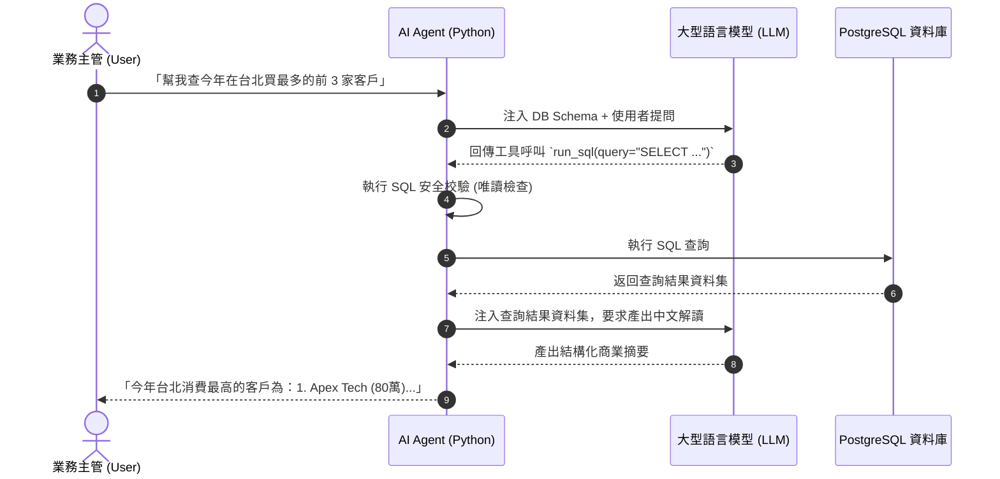

# 02 Text-to-SQL 與 Function Calling 原理解析

## 一、AI Data Agent 運作閉環



---

## 二、SQL 唯讀防護層 (Security Guardrail)

在執行任何 AI 產生的 SQL 前，必須進行嚴格的 AST (抽象語法樹) 或關鍵字過濾：

```python
FORBIDDEN_KEYWORDS = ["DROP", "DELETE", "UPDATE", "INSERT", "ALTER", "TRUNCATE", "GRANT", "REVOKE"]

def validate_safe_sql(sql: str) -> bool:
    clean = sql.strip().upper()
    if not clean.startswith("SELECT") and not clean.startswith("WITH"):
        return False
    for kw in FORBIDDEN_KEYWORDS:
        # 使用正規表達式匹配獨立單詞，避免欄位名稱內含 substring 誤判
        if re.search(r'\b' + kw + r'\b', clean):
            return False
    return True
```
