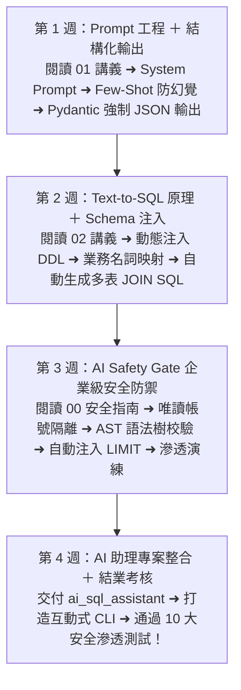

# Month 11｜AI × 資料庫：打造自然語言智慧商業數據助理 (Text-to-SQL)

> **本月核心目標**：在具備 Python + SQL + Database + FastAPI + Docker 的紮實工程底子下，切入生成式 AI (LLM) 落地應用。打造一個 **AI Business Data Assistant**，讓非技術業務或高階主管直接用口語提問（如：「今年台北哪 3 個客戶買最多？」），AI 自動將其轉化為安全可執行的 SQL，查詢資料庫後以繁體中文給出清晰的商業洞察。

---

## 🗺️ Month 11 四步 AI 助理修煉旅程（Roadmap）



---

## 📌 雙軌實作路線：Project 4A vs Project 4B

為了避免零基礎或時間有限的學員負擔過重，M11 正式採行**雙軌分流機制**：

```
                    ┌────────────────────────────────────────────────────────┐
                    │                      Month 11                          │
                    └──────────────────────────┬─────────────────────────────┘
                                               │
                      ┌────────────────────────┴────────────────────────┐
                      ▼                                                 ▼
        【Track A：Data Engineer 必修】                     【Track B：AI 賦能加分項】
          Project 4A: Production Data Pipeline                Project 4B: AI Business Assistant
          - Airflow 定時排程與 DAG 設計                        - Text-to-SQL 智慧數據查詢
          - 自動重試 (Retry) 與 Failure Alert                 - 🛡️ AST SQL Validator 安全防衛
          - Data Quality 自動化監控告警                       - 唯讀權限隔離與自然語言報告生成
```

> **選軌建議**：
> - 目標 **Junior Data Engineer / Data Automation**：請務必完成 **Track A (Project 4A)**。
> - 目標 **AI-Augmented Data Engineer / 爭取更高溢價**：在完成 4A 後挑戰 **Track B (Project 4B)** 作為面試殺手鐧！

---

## 📂 本模組教材與應用程式導航

| 序號 | 篇章名稱 | 核心目標與學習內容 | 推薦時機 |
| :---: | :--- | :--- | :---: |
| **00** | [00_本月學習計畫與目標.md](./00_本月學習計畫與目標.md) | 📅 **4 週 28 天每日學習排程**、Git Commit 規範與驗收標準 | 開學第一天必讀 |
| **安全** | [00_AI_Safety_Gate_安全防禦檢驗標準.md](./00_AI_Safety_Gate_安全防禦檢驗標準.md) | 🏆 **本月結業通關閘門 (AI Safety Gate)**：企業級 AI 防護鏈、AST 語法校驗器程式碼、唯讀帳號隔離與 10 大滲透攻擊評測 | 第 3~4 週 |
| **01** | [01_LLM_API_Prompt工程與Structured_Output.md](./01_LLM_API_Prompt工程與Structured_Output.md) | Prompt 樣板設計、角色設定、防幻覺與 Schema 注入技術 | 第 1 週 |
| **02** | [02_Text_to_SQL與Function_Calling原理解析.md](./02_Text_to_SQL與Function_Calling原理解析.md) | 智慧 Agent 的運作迴圈 (Plan ➜ Tool Call ➜ Execute ➜ Synthesize) | 第 2 週 |
| **專案** | [ai_sql_assistant/](./ai_sql_assistant/) | 🏆 **生產級 AI 數據助理程式碼庫**：含互動式 CLI 介面、AST 校驗器與 Demo 範例 | 第 4 週 |

---

## 🎯 本月三層完成度標準 (Three-Tier Mastery)

- 🟢 **Level 1 — Survival (必做及格線)**：
  - [ ] 能呼叫 OpenAI / Gemini API 透過 Prompt 生成基本 SQL 查詢。
  - [ ] 理解 Prompt Engineering 基礎（System Prompt, Few-Shot 範例）。
- 🔵 **Level 2 — Job Ready (標準求職線，80分晉級)**：
  - [ ] **Track A 必修**：完成 Airflow 定時排程 ETL 管線，具備重試機制與 Data Quality 監控。
  - [ ] 掌握 Function Calling / Tool Use 與結構化輸出 (Pydantic)。
  - [ ] 通過 **[00_AI_Safety_Gate_安全防禦檢驗標準.md](./00_AI_Safety_Gate_安全防禦檢驗標準.md)**（AST 攔截 DROP/DELETE、唯讀帳號隔離與自動注入 LIMIT）。
- 🔴 **Level 3 — Bonus (面試溢價線)**：
  - [ ] **Track B 進階**：完成多角色 AI Agent 工作流（生成 ➜ 語法校驗 ➜ 唯讀執行 ➜ 商業圖表報告）。
  - [ ] 撰寫 AI 評測集，計算 Text-to-SQL 的執行準確率與安全性攔截率。

---

## 🔗 章節導航與跨模組串聯

- **前一模組**：[Month 10 容器化與雲端部署](../10_Month10_容器化與部署_Docker/README.md)（Docker Compose 多容器編排與雲端部署）
- **下一模組**：[Month 12 轉職衝刺與求職寶典](../12_Month12_轉職衝刺與求職寶典/README.md)（中英文履歷打磨、50大核心面試題與求職漏斗看板）
- **回到總目錄**：[12 個月 IT 轉職實戰教材庫主導航](../README.md)

