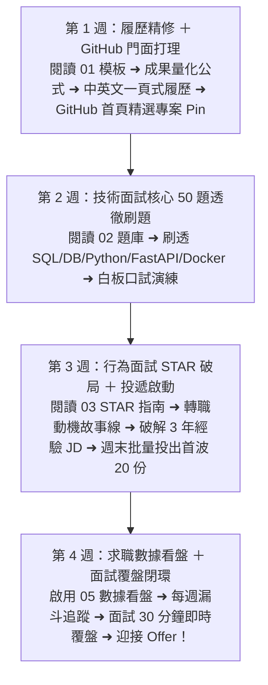

# Month 12｜轉職求職寶典：停止無限學習，開始兌現能力

> **本月核心目標**：將前 11 個月累積的技術專案與過去的 B2B 實務經驗包裝為高含金量的「一頁式中英文履歷」，刷熟 50 大技術面試核心題庫，並以 STAR 原則掌握行為面試，自信開啟求職投遞。

---

## 🗺️ Month 12 四步求職衝刺旅程（Roadmap）

---

## 📂 本模組求職武器庫導航

| 序號 | 篇章名稱 | 核心目標與學習內容 | 推薦時機 |
| :---: | :--- | :--- | :---: |
| **00** | [00_本月學習計畫與目標.md](./00_本月學習計畫與目標.md) | 📅 **4 週 28 天每日衝刺排程**、Git Commit 規範與求職閉環標準 | 開學第一天必讀 |
| **01** | [01_中英文工程師履歷模板_B2B轉職客製化.md](./01_中英文工程師履歷模板_B2B轉職客製化.md) | 專為非本科 B2B 轉職者打造的「成果導向」履歷模板（中英雙語） | 第 1 週 |
| **02** | [02_技術面試核心50題題庫_含標準擬答.md](./02_技術面試核心50題題庫_含標準擬答.md) | SQL Window Functions、ACID、Indexing、Python、FastAPI、Docker 50 大高頻題 | 第 2 週 |
| **03** | [03_轉職非本科面試行為題_STAR法則破局指南.md](./03_轉職非本科面試行為題_STAR法則破局指南.md) | 如何將非本科劣勢轉化為「懂業務、懂跨部門溝通、抗壓自學」的絕對優勢 | 第 3 週 |
| **04** | [04_投遞策略與職缺JD評估檢核表.md](./04_投遞策略與職缺JD評估檢核表.md) | 破解 JD 要求（寫 3 年經驗其實是在找即戰力 Junior）、面試覆盤日誌模板 | 第 3 週 |
| **05** | [05_求職數據實驗室_Job_Search_Dashboard.md](./05_求職數據實驗室_Job_Search_Dashboard.md) | 📊 🏆 **本月結業通關閘門 (Job Ready Gate)**：求職漏斗追蹤表、每週覆盤看盤、弱點閉環迭代 | 第 4 週 |

---

## 🎯 本月三層完成度標準 (Three-Tier Mastery)

- 🟢 **Level 1 — Survival (必做及格線)**：
  - [ ] 完成客製化一頁式中英文工程師履歷初稿。
  - [ ] 整理個人 GitHub Profile，將核心專案 Pin 在首頁。
  - [ ] 開始以每週至少 10 份的節奏穩定投遞履歷。
- 🔵 **Level 2 — Job Ready (標準求職線，80分晉級)**：
  - [ ] 熟練掌握 50 大技術面試核心題庫（SQL、DB 原理、Python、FastAPI、Docker、Airflow）。
  - [ ] 使用 STAR 原則熟練回答「非本科轉職動機」與「專案架構介紹」。
  - [ ] 啟用 **[05_求職數據實驗室_Job_Search_Dashboard.md](./05_求職數據實驗室_Job_Search_Dashboard.md)** 進行每週漏斗數據化覆盤。
  - [ ] 通過 **Job Ready Gate**：每週維持面試弱點閉環迭代，取得首份 Offer！
- 🔴 **Level 3 — Bonus (面試溢價線)**：
  - [ ] 針對特定 High-Priority 目標職缺進行客製化 Cover Letter 與專題技術提案。
  - [ ] 掌握多 Offer 比較與工程師薪資談判技巧（Package 結構與股票期權）。

---

## 🔗 章節導航與跨模組串聯

- **前一模組**：[Month 11 現代資料堆疊與 AI 賦能](../11_Month11_AI賦能_智慧資料助理/README.md)（雙軌分流：Airflow 自動化調度與 Text-to-SQL 智慧助理）
- **回到總目錄**：[12 個月 IT 轉職實戰教材庫主導航](../README.md)（全套轉職架構全景與 12 個月自我檢核表）

