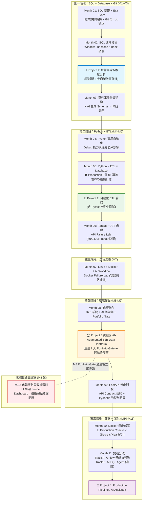

# 🚀 12 個月 IT 轉職實戰教材庫（B2B × AI-Native Data Engineer）

> **「你的核心競爭力不是『我會 Python』，而是『我懂 B2B 商業問題，能用 AI + 技術解決它』。」**

歡迎來到專為 **非本科轉職 Data/Automation Engineer** 量身打造的 12 個月實戰教材體系。本計畫以 **B2B 商業領域知識** 為底座，整合 SQL、Database、Python ETL、FastAPI、Docker、Airflow 與 AI Agent，打造一個真正有商業辨識度的工程師作品集。

---

## 🎯 職涯定位（Career Positioning）

```
❌ 業餘轉職者：「我學了 Python / SQL，我懂 AI Agent」
✅ 目標工程定位：
   「我是 B2B Data Automation / Junior Data Engineer。
    我懂企業資料痛點，能設計高防禦力的 ETL 自動化管線與 3NF 資料庫，
    並以嚴謹的驗證機制（Validator & Guardrails）將 AI 落地為可靠的企業生產力槓桿。」
```

**目標職稱：** Junior Data Engineer ／ Data Automation Engineer ／ B2B Analytics Engineer

---

## 🏛️ 三層完成制度 (Three-Tier Mastery Framework)

在各模組學習時，依時間與目標自我錨定：
- 🟢 **Level 1 — Survival**：跟著教學走完環境配置與範例，程式可執行不報錯（入門及格線）。
- 🔵 **Level 2 — Job Ready**：**不看解答**能獨立寫出核心商業邏輯，通過各月 **Exit Exam（80分晉級）**（**標準求職線，M8起全面投遞**）。
- 🔴 **Level 3 — Interview Ready**：能深入解釋系統架構 Trade-off、底層原理、Index 成本與災難情境應對（面試高薪線）。

---

## 🗺️ 12 個月學習地圖（AI-Native 版）



---

## 📂 教材目錄導航（12 個月 × 12 大 Gate 通關認證）

| 月份模組 | 主題名稱 | 核心內容與實作成果 | 通關考核 (Gate / Exit Exam) | 狀態 |
| :--- | :--- | :--- | :---: | :---: |
| **00 導讀** | [轉職戰略與導讀](./00_轉職戰略與導讀/README.md) | B2B 優勢定位、三層完成制度、AI Policy 5 級階梯、4大求職路徑 | 確立法則與學習閉環 | ✅ |
| **Month 01** | [SQL 基礎 + Git 起手](./01_Month01_SQL基礎/README.md) | PostgreSQL、SELECT/JOIN/GROUP BY、Git 第一天 commit | 🎓 M1 Exit Exam (商業數據偵探 80分) | ✅ |
| **Month 02** | [SQL 進階與分析](./02_Month02_SQL進階與分析/README.md) | Subquery、CTE、Window Functions、Index 調優、**Project 1** | 🎓 M2 Exit Exam (MoM/RFM/Index調優) | ✅ |
| **Month 03** | [資料庫設計與建模](./03_Month03_資料庫設計與建模/README.md) | 3NF 正規化、Index B-Tree 原理、Constraint 破壞測試 | 🎓 M3 Exit Exam (Schema Review 抓6大漏洞) | ✅ |
| **Month 04** | [Python（目標導向）](./04_Month04_Python基礎與實用工具/README.md) | 聚焦 B2B 工具、字串/日期處理、例外除錯排錯防呆 | 🎓 M4 Exit Exam (Python Debug Lab 除錯防呆) | ✅ |
| **Month 05** | [Python × ETL × Database](./05_Month05_Python與資料庫整合自動化/README.md) | **🛡️ Production 三件套：冪等性 (Idempotency)、DQ、Audit Log** | 🎓 M5 Exit Exam (跑兩次無重複+DQ攔截) | ✅ |
| **Month 06** | [Pandas + API 資料處理](./06_Month06_Pandas與API資料處理/README.md) | 資料清洗、REST API 入庫、異常狀態指數退避重試 | 🎓 M6 Exit Exam (API Failure Lab 防禦) | ✅ |
| **Month 07** | [Linux + Docker + AI Workflow](./07_Month07_工程素養_Git與Linux/README.md) | Linux 實用指令、Docker Compose、容器網路排錯診斷 | 🎓 M7 Exit Exam (Docker 容器除錯 Lab) | ✅ |
| **Month 08** | [🏆 旗艦：B2B 客戶數據系統](./08_Month08_旗艦主力專案_B2B客戶數據系統/README.md) | 3NF Schema + Levenshtein 去重 + 企業級安全 AI 防禦鏈 | 🏆 **Portfolio Gate (7大審核，開始投遞)** | ✅ |
| **Month 09** | [FastAPI 後端開發](./09_Month09_後端開發_FastAPI/README.md) | 旗艦專案 API 化、CRUD、API Contract、Pydantic 防呆 | 🎓 M9 Exit Exam (API Contract & 型別防呆) | ✅ |
| **Month 10** | [Docker 容器化與雲端部署](./10_Month10_容器化與部署_Docker/README.md) | 一鍵 Compose 啟動、雲端部署、Secrets 不進 Git | 🚀 **Production Gate (10大上線檢核+冒煙測試)** | ✅ |
| **Month 11** | [Airflow 管線與 AI 助理](./11_Month11_AI賦能_智慧資料助理/README.md) | **雙軌制**：Track A (Airflow 自動化) / Track B (安全 AI Agent) | 🤖 **AI Safety Gate (AST校驗+滲透評測)** | ✅ |
| **Month 12** | [求職衝刺與數據看盤](./12_Month12_轉職衝刺與求職寶典/README.md) | 📊 **求職數據實驗室**：每週 Funnel 追蹤、技術弱點覆盤閉環 | 🎯 **Job Ready Gate (取得 Offer 簽約)** | ✅ |

---

## 🔥 四大主力作品（清楚拆分 4A 必修與 4B 加分）

> **說明**：Project 1–3 為所有路徑的核心必修；Project 4A 為 Data Engineer 路線必修；Project 4B 為選修加分項目，適合偏 AI 應用方向的學習者。

```
┌─────────────────────────────────────────────────────────────────────────────┐
│ Project 1：B2B 企業百萬級銷售數據決策分析 (Month 2)                        │
│   ➜ 10,000+ 筆銷售數據、RFM 動態分群、MoM 增長率、巨量 Index 調優面試化 README │
├─────────────────────────────────────────────────────────────────────────────┤
│ Project 2：企業級自動化 ETL 管線 (Month 5)                                  │
│   ➜ 注入 Production 三件套：冪等性 (Idempotency) + Data Quality + 稽核日誌     │
│   ➜ 整合 Pytest 單元測試，保證重複執行資料零污染、髒資料 100% 攔截告警      │
├─────────────────────────────────────────────────────────────────────────────┤
│ Project 3：AI-Augmented B2B Data Platform (Month 8–10) 🏆 旗艦主力專案      │
│   ➜ 3NF 正規化 + Levenshtein 模糊去重 + FastAPI + Docker Compose           │
│   ➜ 🛡️ 企業級安全防禦鏈：                                                   │
│      User ➜ Question ➜ AI SQL ➜ SQL Validator ➜ Permission ➜ DB ➜ Explain   │
│   ➜ 達成 7 大 Portfolio Gate 審查標準，錄製 3 分鐘高轉換 Demo              │
├─────────────────────────────────────────────────────────────────────────────┤
│ Project 4A：Production Data Pipeline (Month 11) 【Data Engineer 必修】       │
│   ➜ Airflow 定時排程與 DAG 調度、自動重試 (Retry)、Data Quality 監控與告警  │
├─────────────────────────────────────────────────────────────────────────────┤
│ Project 4B：AI Business Data Assistant (Month 11) 【AI 賦能加分項】          │
│   ➜ Text-to-SQL 智慧助理、AST SQL 語法校驗器 (禁DROP/DELETE)、唯讀帳號隔離  │
└─────────────────────────────────────────────────────────────────────────────┘
```

---

## 🧪 貫穿全課程的測試主線 (Testing Mindset)

教材不再將測試視為個別工具，而是建立全鏈路的工程品質主線：
- **M1 SQL 對帳測試** ➜ **M2 查詢極值邊界測試** ➜ **M3 Constraint 破壞測試** ➜ **M4 Python 單元測試**
- ➜ **M5 ETL Pytest 測試** ➜ **M6 API 模擬測試 (Mocking)** ➜ **M7 Docker 健康檢查** ➜ **M8 E2E 整合測試**
- ➜ **M9 FastAPI TestClient 測試** ➜ **M10 雲端冒煙測試 (Smoke Test)** ➜ **M11 AI 安全滲透評測** ➜ **M12 作品健康度掃描**

---

## 🎯 4 大目標職位路徑 (Build Paths：不必學完 12 個月才求職)

1. 🏃 **Path A (Data Analyst 商業數據分析師)**：M1 ➜ M2 (Project 1) ➜ M3 ➜ M6 ➜ M12（約 4~5 個月即可求職）
2. ⚡ **Path B (Data Automation Engineer 資料自動化工程師)**：M1 ➜ M2 ➜ M4 ➜ M5 (Project 2) ➜ M6 ➜ M7 ➜ M12（約 6~7 個月即可求職）
3. 🏆 **Path C (Junior Data Engineer 初階資料工程師 - 核心旗艦)**：M1 ➜ M2 ➜ M3 ➜ M4 ➜ M5 ➜ M6 ➜ M7 ➜ M8 (Project 3 通過 7 大 Gate) ➜ M10 ➜ M11 (Project 4A) ➜ M12
4. 🛠️ **Path D (Junior Backend Engineer 初階後端工程師)**：M1 ➜ M3 ➜ M4 ➜ M7 ➜ M8 ➜ M9 ➜ M10 ➜ M12

---

## ⚡ AI-Native 學習原則

> 學習不是「背技術」，而是「能設計方案、能驗證 AI 產出、能對結果負責」。

```
每個主題的學習循環：

自己先想 → 自己先寫 → AI 比較差異 → 理解為什麼 → 改進

❌ 不是：AI 生成 → 複製貼上 → 完成
```

---

## 📋 年度自我追蹤 Checklist

- [ ] **Month 1**：SQL 基礎 + **Git/GitHub 第一天就建立**，開始 commit 學習軌跡
- [ ] **Month 2**：搞懂 Window Functions，完成並開源 Project 1
- [ ] **Month 3**：設計 B2B ER 圖，練習「AI 生成 Schema → 自己找問題」
- [ ] **Month 4**：Python 聚焦 B2B 工具，3 款小工具完成
- [ ] **Month 5**：Project 2 ETL Pipeline 完成，有 Logging / Config / Error Handling
- [ ] **Month 6**：API 資料入庫，建立 AI 協助 Code Review 的日常習慣
- [ ] **Month 7**：Linux 基礎 + Docker Compose 可用，AI Coding 工作流定型
- [ ] **Month 8**：旗艦作品完成，架構圖 + Demo + README 完整 → **開始投履歷**
- [ ] **Month 9**：B2B 系統 API 化，Swagger 文件完整，Postman 可測試
- [ ] **Month 10**：docker-compose 一鍵啟動，部署到雲端有可存取 URL
- [ ] **Month 11**：Airflow 排程 ETL 或 AI Agent 多角色系統，Project 4 完成
- [ ] **Month 12**：根據面試回饋補強，每週追蹤投遞結果，持續迭代

---

## 📌 求職策略（不等 M12 才開始）

```
M1–M3   → 建立 GitHub，開始整理工作中遇到的資料問題
M4–M6   → 開始研究目標職缺的 JD，調整學習重心
M7      → 整理初版履歷
M8      → 旗艦作品完成 → 開始投遞
M9–M12  → 邊面試邊補強，根據 JD 回饋調整方向
```

**你的最終定位：**

> ~~「我沒有本科學歷，但我對 IT 很有興趣。」~~
>
> **「我有 B2B 工作經驗，懂企業資料問題，熟悉 SQL / Database，能做 ETL 自動化，能建 API、部署服務，並且有 AI Agent + B2B 系統的完整旗艦作品。」**
